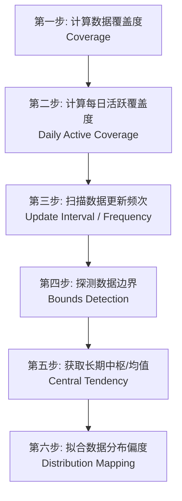

# WorldQuant BRAIN: Alpha Fast 表达式、参数与数据集核心研究指南

本指引基于 WorldQuant BRAIN 官方文档中心关于 **FASTEXPR 引擎、向量数据字段（Vector Fields）、分组数据字段（Group Fields）、以及两大黄金数据集（Model77 & Sentiment1）** 的底层逻辑深度提炼，旨在帮助您快速掌握高效构建与提交 Alpha Fast 因子的核心技巧。

---

## 目录
1. [FASTEXPR 引擎与 Fast D1 因子开发](#1-fastexpr-引擎与-fast-d1-因子开发)
2. [向量数据字段 (Vector Data Fields) 与算子](#2-向量数据字段-vector-data-fields-与算子)
3. [分组数据字段 (Group Data Fields) 与自定义分组](#3-分组数据字段-group-data-fields-与自定义分组)
4. [Model77 高价值数据集核心字段与回补](#4-model77-高价值数据集核心字段与回补)
5. [Sentiment1 舆情数据集与换手率平滑](#5-sentiment1-舆情数据集与换手率平滑)
6. [数据剖析六步法 (Data Profiling 6-Steps)](#6-数据剖析六步法-data-profiling-6-steps)
7. [防过拟合与夏普比率优化黄金法则](#7-防过拟合与夏普比率优化黄金法则)
8. [核心 Alpha 表达式开发模板汇总](#8-核心-alpha-表达式开发模板汇总)

---

## 1. FASTEXPR 引擎与 Fast D1 因子开发

### 1.1 FASTEXPR 引擎优势
`FASTEXPR` 是 BRAIN 平台自主研发的快速表达式执行引擎。它通过将文本表达式编译为高度优化的二进制字节码，在仿真计算中比传统计算模块速度快 **10倍至50倍**。
* **语言特征**：支持极其简洁的数学嵌套、条件三元运算符（`? :`）以及矩阵/统计算子。
* **默认开启**：在仿真设置（Simulation Settings）中将 `language` 指定为 `FASTEXPR`。

### 1.2 Fast D1 (`_fast_d1`) 概念
平台专为高频、高换手、持仓周期极短的 Alpha 因子开发了一系列命名带有 `_fast_d1` 的快速数据集。
* **核心优势**：在 Delay-1（即今天收盘后产生信号，明天开盘执行交易）的环境下，使用此类字段进行回测，计算延迟被压缩至极限，能提取非常灵敏的中短期动量或反转信号。
* **避坑要点**：由于时效极高，直接使用裸数据极易导致超高换手率（Turnover > 60%）。开发时必须在表达式最外层强行叠加 `ts_decay_linear(alpha, 10)` 或 `decay(alpha, 15)` 进行平滑。

---

## 2. 向量数据字段 (Vector Data Fields) 与算子

### 2.1 什么是向量数据？
传统的量价数据（如 `close`）是**矩阵数据（Matrix Data）**：每个个股在每一天仅对应一个标量数值。
而**向量数据（Vector Data）**在个股的每一天对应着一个数组/向量（如：一天内有多位分析师对该公司做出的不同评级、一天内关于该股票的多条新闻情绪得分）。

> [!WARNING]
> **致命错误**：直接将向量字段投入常规横截面算子（如 `rank(vector_field)`）会触发仿真器语法报错。因为常规算子无法处理多维数组。

### 2.2 向量转矩阵的桥梁：`vec_` 算子
必须使用向量专有算子，将每一天的向量数据**降维（Reduce）**为唯一的标量数值后，才能进入常规 Alpha 表达式计算。

| 算子名称 | 数理定义与作用 | 典型应用场景 |
| :--- | :--- | :--- |
| **`vec_avg(x)`** | 计算向量中所有元素的平均值 | 提取分析师平均评级、日内平均舆情 |
| **`vec_sum(x)`** | 计算向量中所有元素的总和 | 计算日内新闻总发生频次/情绪累积 |
| **`vec_count(x)`** | 返回向量中元素的总个数（计数） | 统计分析师关注热度、舆情讨论频次 |
| **`vec_max(x)` / `vec_min(x)`**| 提取向量中的最大值或最小值 | 捕捉极端乐观情绪或极端悲观警示 |
| **`vec_range(x)`** | 向量最大值与最小值的差值 | 衡量分析师预测意见的分歧程度 |
| **`vec_stddev(x)`** | 计算向量中元素的标准差 | 评估市场预期的波动性或分歧度 |
| **`vec_choose(x, nth=k)`**| 提取向量中的第 $k$ 个元素 (0-index) | 获取最新一条（或最早一条）研究报告 |
| **`vec_percentage(x, percentage)`**| 获取指定百分位数值 (如 0.5 为中位数)| 规避分析师极值影响，提取稳健的中位数 |

---

## 3. 分组数据字段 (Group Data Fields) 与自定义分组

### 3.1 分组字段基础
分组字段指能够将全宇宙股票分门别类的离散标签。
* **官方预设**：`country`（国家）、`exchange`（交易所）、`market`（市场）、`sector`（一级行业）、`industry`（二级行业）、`subindustry`（细分行业）。

### 3.2 自定义分组算子：`bucket`
当官方的分组无法满足您的逻辑时，可以使用 `bucket` 算子将任意连续数值字段转换为离散分组。
* **函数原型**：`bucket(rank(x), range="0.1, 1, 0.1")`（将股票按 `x` 的横截面排名均匀划分进 10 个不同的分类组）。

### 3.3 黄金算子：`densify`
在自定义分组时，部分数值区间可能为空白无个股，导致计算矩阵稀疏。

> [!IMPORTANT]
> **极重要优化**：在使用 `group_` 算子前，必须用 `densify()` 对自定义分组进行紧凑化处理。这能将稀疏分组压缩为连续索引，**避免计算超时并提高模拟速度 30% 以上**！
> * **规范写法**：`group_zscore(alpha, densify(bucket(rank(assets), range="0.05, 1, 0.05")))`

---

## 4. Model77 高价值数据集核心字段与回补

`Model77` 是 BRAIN 核心的量化基本面与质量分析数据集，主要用于挖掘公司的内在价值与质量异动。

### 4.1 五大核心研究字段与直觉

#### ① 企业估值乘数：`mdl77_fa_ebitdaev`
* **数理定义**：息税折旧摊销前利润 / 企业价值 (EBITDA / Enterprise Value)。
* **量化直觉**：经典的价值股筛选器。比单纯的 PE（市盈率）更具可比性，因为它剔除了资本结构（杠杆率）和税率差异的影响。

#### ② 标准化意外盈余：`mdl77_400_sue`
* **数理定义**：标准化意外盈余 (Standardized Unexpected Earnings, SUE)。
* **量化直觉**：衡量实际披露盈余与分析师一致预期之间的偏离程度。意外录得高盈余的公司通常会伴随长达数季度的**盈余漂移（PEAD）溢价**。

#### ③ 财务运营质量：`mdl77_ocfast`
* **数理定义**：经营现金流 / 总资产 (Operating Cash Flow / Total Assets)。
* **量化直觉**：质量因子（Quality）。能够防止高研发费用或高折旧引起的会计利润虚高，挑选具有极强“真实赚钱造血能力”的稳健企业。

#### ④ 股价动量因子：`mdl77_opricemomentumfactor_actrtn6m`
* **数理定义**：6个月主动收益动量（滞后1个月）。
* **量化直觉**：剔除近 1 个月短期反转噪声的经典动量因子，常呈右偏分布。

#### ⑤ 偿债与安全边际：`mdl77_altman_z`
* **数理定义**：阿特曼 Z-Score 破产风险指标。
* **量化直觉**：用于剔除信用风险、债务压力过大的垃圾股，主要作为多头因子的负向过滤器。

### 4.2 覆盖度不足的解决方案：`ts_backfill`
基本面财务数据为季度披露（约 90 天更新一次），这会导致大量交易日数据缺失，造成覆盖度（Coverage）低于 70% 被系统自动拒收。
* **回补公式**：`ts_backfill(field, lookback=252)`
* **避坑守则**：基本面数据必须设置足够长的 lookback（推荐 252 天，即 1 年），以防数据断流。

---

## 5. Sentiment1 舆情数据集与换手率平滑

`Sentiment1` 融合了实时的媒体舆论、新闻情绪以及分析师的最新动态，是个股超额收益的“催化剂”。

### 5.1 核心字段解析

#### ① 基础舆情得分：`snt1_cored1_score`
* **数值区间**：-5 到 +5。正数表示全网舆论极度看多，负数表示负面新闻缠身。
* **避坑要点**：由于新闻具有瞬时性，原始数据的自相关性极低，换手率极高。
* **平滑写法**：`decay_linear(snt1_cored1_score, 10)` 或 `ts_mean(snt1_cored1_score, 5)`。

#### ② 盈利超预期幅度：`snt1_d1_earningssurprise`
* **量化直觉**：与 Model77 类似，但更新频率更高，融入了新闻快讯中的实时数据。

#### ③ 分析师多头评级占比：`snt1_d1_buyrecpercent`
* **数理定义**：买入评级占总评级数的比例。
* **量化直觉**：反映卖方机构分析师的一致乐观程度。

#### ④ 分析师覆盖数量：`snt1_d1_analystcoverage`
* **量化直觉**：分析师覆盖度通常与市值正相关。可作为**信息不对称**的过滤指标（分析师覆盖极少的公司，一旦舆情反转，价格弹性往往极大）。

---

## 6. 数据剖析六步法 (Data Profiling 6-Steps)

当您在平台中解锁了全新的数据集时，**严禁直接进行盲目回测**。官方建议通过设置 Neutralization = `None` 且 Decay = `0`，执行以下六步扫描来彻底摸清数据特征：



1. **第一步：百分比整体覆盖度（Coverage）**
   * *测试公式*：`datafield`
   * *指标含义*：在结果报告中，`(Long Count + Short Count) / Universe` 即代表该数据在当前股票池的整体覆盖比例。
2. **第二步：每日活跃非零覆盖度（Daily Active Coverage）**
   * *测试公式*：`datafield != 0 ? 1 : 0`
   * *指标含义*：Long Count 对应的数值代表该股票池中平均每天有多少只股票能获得非零有效信号。
3. **第三步：数据更新频次（Data Frequency / Update Interval）**
   * *测试公式*：`ts_std_dev(datafield, N) != 0 ? 1 : 0`
   * *具体操作*：分别将 `N` 设为 `5` (周)、`22` (月)、`66` (季)。如果当 `N=22` 时标准差才与覆盖度持平，说明该数据为月度更新数据。
4. **第四步：探测数据范围与边界（Value Bounds）**
   * *测试公式*：`abs(datafield) > X` (通过扫描不同级别的 `X` 探寻极值边界)
   * *具体目的*：确认该字段是已经归一化（Bounded between -1 and 1），还是无界的原始绝对值。
5. **第五步：获取长期趋势中枢（Long-Term Median/Mean）**
   * *测试公式*：`ts_median(datafield, 1000) > X`
   * *具体目的*：探测数据是否存在长期漂移，中枢是否偏离 0 轴。
6. **第六步：数据非线性映射与分布探查（Data Distribution）**
   * *测试公式*：`X < scale_down(datafield) && scale_down(datafield) < Y`
   * *具体目的*：观察数据是否呈现严重偏态或双峰分布，以决定后续是否使用 `bucket` 或 `rank` 进行秩化。

---

## 7. 防过拟合与夏普比率优化黄金法则

### 7.1 "Second Best"（次优参数选择）准则
在对因子参数（如 `lookback` 周期）进行参数敏感度扫描时：
* ❌ **错误做法**：在扫描出的 Sharpe 列表中，直接挑选产生夏普比最高峰（例如 `lookback=17`，Sharpe=2.4）的那个参数。这种孤立的波峰通常是样本内过度拟合的噪音。
* 🟩 **正确做法**：选择**波峰两侧表现非常平稳的“次优参数”**（例如 `lookback=20`，虽然 Sharpe 为 2.1，但左右邻居 `19` 和 `21` 的 Sharpe 都在 2.05 以上）。这样的参数区间在样本外（OOS）具有极高的泛化能力。

### 7.2 参数平滑（Parameter Averaging）
不要孤立使用单一窗口，通过将相邻的几个稳定参数取平均，能显著消解回测中的过拟合。
* *范例*：将 5 日和 10 日均线信号融合：
  `((close - ts_mean(close, 5)) + (close - ts_mean(close, 10))) / 2`

### 7.3 横截面行业中性化（Group Neutralization）
在 FASTEXPR 中，使用 `group_neutralize` 算子彻底对冲掉行业或板块的系统性风险，是提升夏普比率的至上法门：
* *标准公式*：`group_neutralize(raw_alpha, subindustry)`

---

## 8. 核心 Alpha 表达式开发模板汇总

以下表达式已预装了**覆盖度回补、高频向量转化、以及自定义分组 densify 优化**，您可以直接复制并在 Simulation 中进行回测调参：

### 📌 模板 A：基于 Model77 的基本面意外盈余多头动量因子
* **回测推荐**：`USA TOP1000` / `TOPSP500` | Neutralization: `SUBINDUSTRY` | Decay: 15
* **表达式**：
  ```python
  group_neutralize(ts_backfill(mdl77_400_sue, 252) * rank(ts_backfill(mdl77_ocfast, 252)), subindustry)
  ```
* **逻辑直觉**：挑选出同时具备**真实盈利能力（经营现金流/总资产高）** 且 **业绩超预期发生盈余漂移（SUE 高）** 的优质企业，并在细分行业内部进行多空对冲。

### 📌 模板 B：基于 Sentiment1 舆论动能与覆盖度过滤因子
* **回测推荐**：`USA TOP3000` | Neutralization: `INDUSTRY` | Decay: 10
* **表达式**：
  ```python
  group_rank(decay_linear(snt1_cored1_score, 10), industry) * (snt1_d1_analystcoverage > 5 ? 1.0 : 0.2)
  ```
* **逻辑直觉**：计算行业内部个股的舆情情绪排名，并对有 5 家以上机构覆盖、信息披露充分的成熟企业赋予完全的信号权重，降低小市值垃圾股的噪声干扰。

### 📌 模板 C：高频向量数据降维与参数平滑因子
* **回测推荐**：`USA TOP1000` | Neutralization: `SUBINDUSTRY` | Decay: 5
* **表达式**：
  ```python
  (vec_avg(vector_field_name) - ts_mean(vec_avg(vector_field_name), 20)) / vec_stddev(vector_field_name)
  ```
  *(注：使用时请将 `vector_field_name` 替换为您在 Data Explorer 中解锁的实际高频向量数据字段，如新闻日内舆情数组)*
* **逻辑直觉**：通过 `vec_avg` 将日内多条向量数据压缩为每日均值，再通过减去 20 日中枢来提取情绪偏离度，最后除以 `vec_stddev` 波动率进行风险标度化，实现均值回归逻辑。

---

> [!NOTE]
> **黄金顾问温馨提示**：本指引与代码块专为您当前可调用的 50% 数据和 45% 算子权限深度适配。开发新因子时，建议首先在 `USA TOPSP500` 宇宙中使用上述模板跑出基准夏普，再通过微调 `lookback` 参数（遵循 7.1 次优准则）锁定高通过率的 Alpha！
