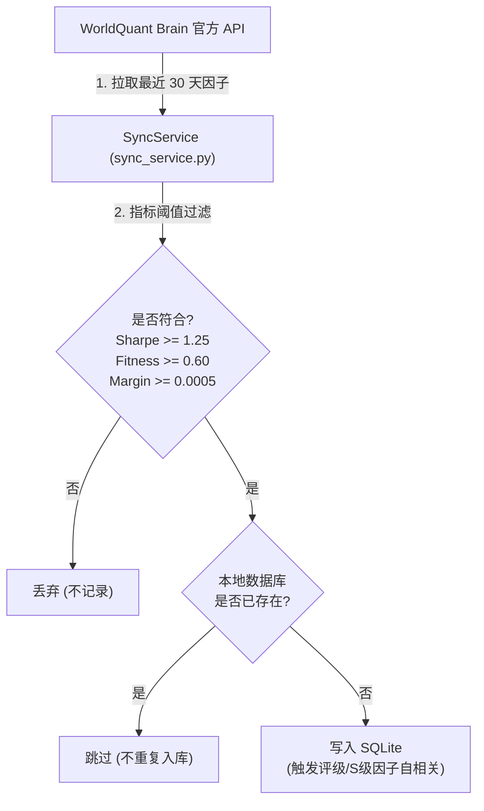

# Alpha Acquisition 因子拉取与筛选

本模块主要负责与 WorldQuant Brain 服务器进行网络交互，增量式获取远端因子并落库。

---

## 服务器因子获取流转图

---

## 因子筛选与落库规则

在执行“获取服务器因子”任务时，系统经历以下阶段：
1. **区间分片下载**: 为防止 WQ 单次最多拉取 10,000 条记录引发的 offset 截断，系统并发对 30 天 lookback 按照 1 天为单位拆分成时间分片下载。
2. **夏普/边际硬过滤**: 仅提取满足以下三个硬指标阈值标准的因子：
   * Sharpe $\ge$ 1.25
   * Fitness $\ge$ 0.60
   * Margin $\ge$ 0.0005
3. **本地数据库去重**: 拿拉取到的因子与本地 `alpha_records` 中的 `alpha_id` 比对，已有记录的直接跳过，仅对全新因子做入库。
4. **S级因子自相关标记**: 在新因子插入本地时，若判定评级为 S 级，会同时将其缓存为待计算对象，在随后阶段中自动发起本地 Pearson 线性自相关计算，非 S 级的新因子跳过此自动计算。

---

## 核心组件与代码映射

* **服务器增量拉取与硬过滤**: `run_get_server_alphas_job` 中实现的时间分片下载与硬过滤阈值循环。
  * 源码位置: [sync_service.py:L138](file:///d:/code/WorldQuant%20Brain/consultant/gui/app/services/sync_service.py#L138)
* **缺失静态指标增量修补**: `fix_missing_metrics` 用于从 WQ 批量提取因子缺失的 returns、drawdown 等数据并写入。
  * 源码位置: [sync_service.py:L57](file:///d:/code/WorldQuant%20Brain/consultant/gui/app/services/sync_service.py#L57)
