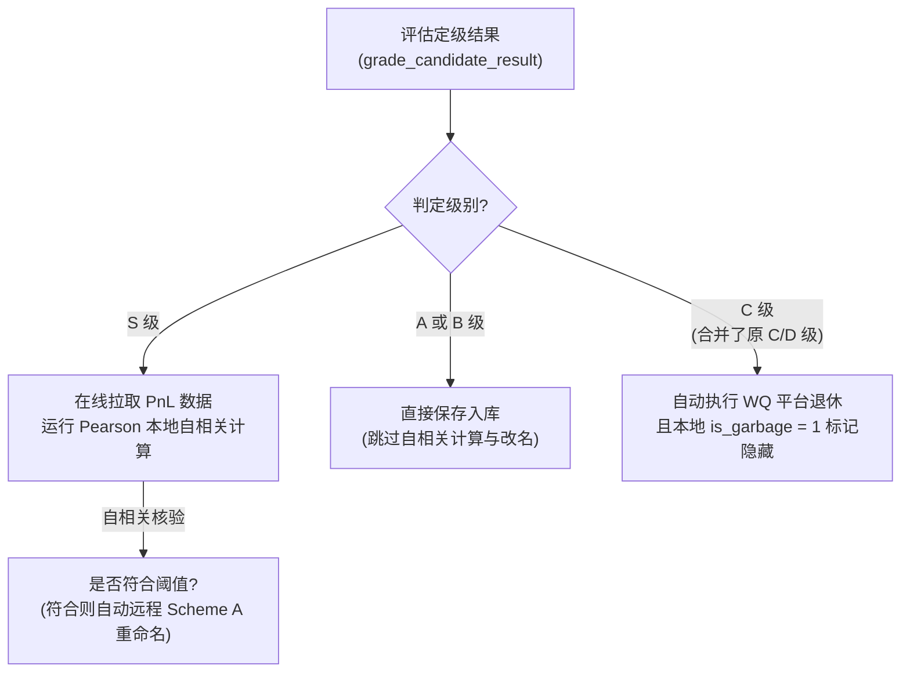

# Alpha Grading Model 因子评级诊断模型

系统拥有一套专门的定级分类器，对因子的夏普、边际、换手、自相关性及仿真状态进行综合打分诊断，将因子评定为 S, A, B, C 四个档位。

---

## 因子评级分档与后续流转决策图

---

## 因子评级分档规则

* **S 级 (黄金直接提交)**: 
  * 满足：`self_corr <= 0.68` 且 `prod_corr < 0.50` 且 `Sharpe >= 1.58` 且 `Fitness >= 1.0` 且 `Margin >= 0.0010`。
* **A 级 (标准优秀候选)**: 
  * 满足：`self_corr <= 0.70` 且 `prod_corr < 0.70` 且 `Sharpe >= 1.50` 且 `Fitness >= 0.80` 且 `Margin >= 0.0008`。
* **B 级 (需要人工审核)**: 
  * 满足：`self_corr <= 0.70` 且 `prod_corr < 0.70` 且 `Sharpe >= 1.25` 且 `Fitness >= 0.60` 且 `Margin >= 0.0005`。
* **C 级 (垃圾或需优化因子)**: 
  * 不符合上述等级标准的，或存在致命缺陷（如年化收益率零值、极低股票覆盖数、表达式未来函数泄漏等）的所有因子，均会被判定为 **C 级**（原 D 级在此次重构中已完全废弃，并与 C 级合并）。

---

## 核心组件与代码映射

* **决策树分类决策入口**: `grade_candidate_result` 中具体的夏普、自相关度及致命缺陷原因（`reasons`）诊断判定。
  * 源码位置: [template_iteration.py:L368](file:///d:/code/WorldQuant%20Brain/consultant/gui/app/services/template_iteration.py#L368)
* **评级转换与 labels 定义**: `build_alpha_rating` 对因子包属性进行缓存、转换、以及绑定对应评级文字描述。
  * 源码位置: [alpha_rating.py:L152](file:///d:/code/WorldQuant%20Brain/consultant/gui/app/services/alpha_rating.py#L152)
