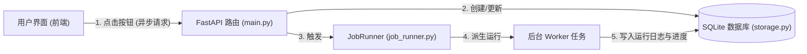

# System Overview

本系统为一个基于 FastAPI 和 SQLite 的 WorldQuant Brain 因子本地辅助开发与优化平台。

---

## 任务分发与异步执行流程图

---

## 核心设计与模块交互

系统由以下三个核心图层共同构成：
1. **Web 服务与路由层**: 由 FastAPI 驱动，负责前后端 API 交互、静态页面渲染与参数配置管理。主要源文件在 [main.py](file:///d:/code/WorldQuant%20Brain/consultant/gui/app/main.py)。
2. **任务调度与队列层**: 包含任务记录存储与基于子进程的异步任务分发机制，支持用户在前端触发耗时任务（如拉取服务器因子、刷新相关性）而在后台非阻塞运行。主要代码在 [job_runner.py](file:///d:/code/WorldQuant%20Brain/consultant/gui/app/job_runner.py)。
3. **数据管理与业务服务层**: 包含 SQLite 数据库增删改查逻辑、远程 Brain API 对接、因子评级诊断模型以及 Pearson 线性自相关度计算。

---

## 核心路由指向

* **Web 启动与全局初始化**: 注册全局 lifespan 事件，包含检测本地 IP 友好打印等功能。
  * 源码位置: [main.py:L553](file:///d:/code/WorldQuant%20Brain/consultant/gui/app/main.py#L553)
* **因子列表与状态更新端点**: 
  * 因子详情 PnL 图表渲染路由: [main.py:L1925](file:///d:/code/WorldQuant%20Brain/consultant/gui/app/main.py#L1925)
  * 获取服务器因子触发端点: [main.py:L1960](file:///d:/code/WorldQuant%20Brain/consultant/gui/app/main.py#L1960)
  * 刷新自相关性触发端点: [main.py:L1989](file:///d:/code/WorldQuant%20Brain/consultant/gui/app/main.py#L1989)
