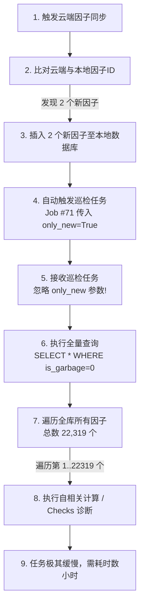
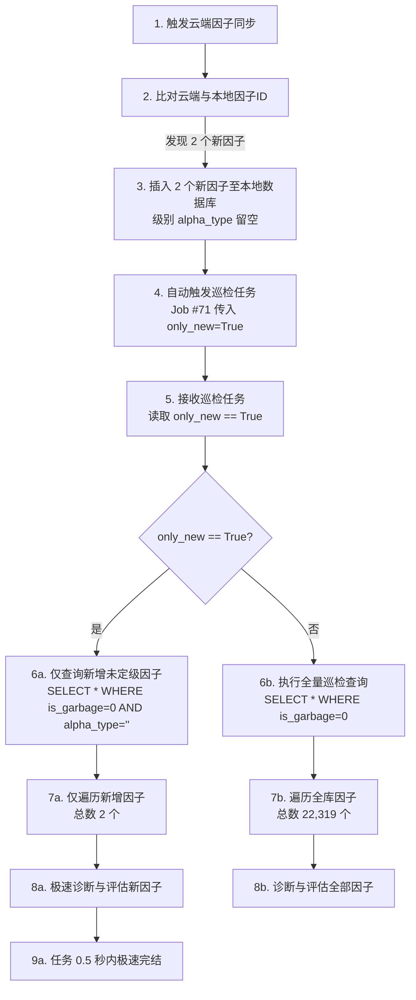

# 「自动评估新增云端因子」扫描全部因子的逻辑漏洞分析 (Logic Bug & Flowchart)

本报告详细说明了在同步完云端因子后，自动拉起的巡检任务（Job #71）为什么会扫描本地数据库中的全部 2.2 万个因子，并给出修复前后的逻辑流程对照图。

---

## 1. 现象描述与故障原因

### 1.1 业务现象
*   云端同步任务完成后，显示：“同步完成，共新增 **2** 个因子。正在启动评估校验任务... 已自动触发评估任务 Job #71”。
*   然而，随后运行的 Job #71 状态却一直显示：
    `Pool 766 / 22319 (3%)` 并且正在对大量历史因子进行自相关补算。
*   用户产生疑问：既然显示“自动评估新增云端因子 (2 个)”，为什么 Pool 总数是 22319 个，而不是 2 个？

### 1.2 源码层面的逻辑缺陷
1.  **参数传递端 (`sync_service.py` L192-197)**：
    当云端同步发现新因子时，系统创建并拉起了一个 `alpha_inspection` (因子巡检) 任务：
    ```python
    new_job_id = create_job("alpha_inspection", "自动评估新增云端因子 (2 个)", {"only_new": True})
    JobRunner().start_job(new_job_id, "alpha_inspection", {"only_new": True})
    ```
    这里确实正确传入了 `{"only_new": True}` 参数，意图只对这 2 个新因子进行评估。
2.  **接收执行端 (`sync_service.py` L231-255)**：
    `run_alpha_inspection_job(job_id, params)` 的内部实现中：
    ```python
    def run_alpha_inspection_job(job_id: int, params: dict[str, Any]) -> None:
        ...
        # 1. 查找所有未被标记为 garbage 的因子
        with connect() as conn:
            rows = conn.execute("SELECT * FROM alpha_records WHERE is_garbage = 0").fetchall()
    ```
    **漏洞所在**：执行函数**完全忽略了对 `params.get("only_new")` 的读取和过滤逻辑**！
    不论 `params` 传入什么值，它都无条件执行了 `SELECT * ... WHERE is_garbage = 0`，导致把本地数据库所有的 2.2 万个因子全部载入内存并逐个进入诊断评估和补算循环，造成了极其漫长且无意义的重复算力开销。

---

## 2. 代码逻辑流程图对照

### 2.1 当前有 Bug 的逻辑流程 (Current Buggy Workflow)



---

### 2.2 优化修复后的预期逻辑流程 (Proposed Correct Workflow)



---

## 3. 后续修复方案建议

为了彻底解决此问题，后续可以对 `run_alpha_inspection_job` 执行如下修复：

```python
    # 读取 params 中的 only_new 过滤标识
    only_new = params.get("only_new", False) if isinstance(params, dict) else False
    
    # 1. 查找待评估的因子列表
    with connect() as conn:
        if only_new:
            # 仅查询尚未定级/评级为空的新同步因子 (alpha_type = '')
            rows = conn.execute(
                "SELECT * FROM alpha_records WHERE is_garbage = 0 AND (alpha_type IS NULL OR alpha_type = '')"
            ).fetchall()
        else:
            # 全量巡检
            rows = conn.execute(
                "SELECT * FROM alpha_records WHERE is_garbage = 0"
            ).fetchall()
```
此方案在保留全量巡检功能的同时，使得同步后的自动校验能实现真正的“定向秒级处理”，极大节省本地 CPU 资源和网络开销。
