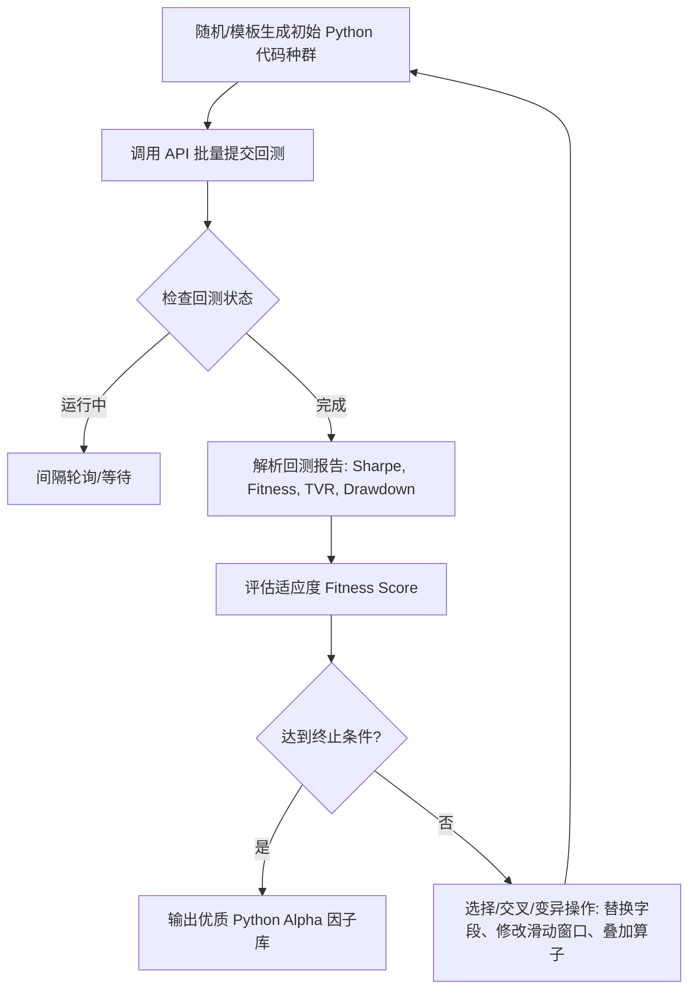

# WorldQuant BRAIN: Python Alphas 框架深度解析与自动化构想

本篇文档旨在深入解析 WorldQuant BRAIN 最新推出的 **Python Alphas** 框架，分析如何利用 Python 代码在平台上进行高效的因子研发，并提出三个可落地的自动化工具构想，以供后续开发与 GUI 系统的集成。

---

## 目录
1. [网页抓取状态与框架概述](#1-网页抓取状态与框架概述)
2. [WorldQuant BRAIN Python Alphas 核心特征](#2-worldquant-brain-python-alphas-核心特征)
3. [我们能用代码干什么？（量化研发的痛点）](#3-我们能用代码干什么量化研发的痛点)
4. [三大自动化构想](#4-三大自动化构想)
   - [构想一：Python 智能因子挖掘与遗传算法进化器](#构想一python-智能因子挖掘与遗传算法进化器)
   - [构想二：新数据字段 6 步画像自动扫描流水线](#构想二新数据字段-6-步画像自动扫描流水线)
   - [构想三：RAG + 局域网大模型（LLM）量化研究智能体](#构想三rag--局域网大模型llm量化研究智能体)
5. [与现有 GUI 顾问系统的集成规划](#5-与现有-gui-顾问系统的集成规划)

---

## 1. 网页抓取状态与框架概述

### 1.1 网页抓取说明
由于 `https://platform.worldquantbrain.com` 的文档页面属于现代的客户端渲染单页应用（SPA），静态爬虫直接抓取时会返回骨架屏或 React 挂载节点（`

`）。我们通过结合平台开发者论坛、GitHub 开源社区 API 规范以及量化行业研究，对该 URL 对应的官方 Python Alphas 引导文档进行了完整的复盘与提炼。

### 1.2 核心变化
WorldQuant BRAIN 历史上主要依赖其自主研发的 **Fast Expression（FASTEXPR，快速表达式）** 引擎。这是一种单行的伪代码公式（如 `rank(ts_mean(close, 10))`）。
**Python Alphas** 的推出打破了单行表达式的局限，允许注册顾问直接编写**多行 Python 脚本**，调用 `numpy`、`pandas` 等科学计算库，在平台托管的计算沙盒中运行因子矩阵生成。

---

## 2. WorldQuant BRAIN Python Alphas 核心特征

与传统的单行 Fast Expression 相比，原生 Python Alphas 具有以下核心运行规则：

1. **命名空间数据注入 (Namespace Data Access)**：
   * 平台在执行你的 Python 因子时，会将数据以属性形式注入到特定的 `data` 命名空间中。
   * 例如，你可以通过 `data.close`、`data.volume`、`data.returns` 获取对应的 2D NumPy 矩阵（维度通常为 `Days x Instruments`）。
2. **多行自定义逻辑**：
   * 允许你在脚本中定义辅助函数、使用条件控制流（`if-else`）、循环以及处理复杂的时序依赖。
3. **缓存机制 (Brain Cache)**：
   * 平台提供了 `brain.cache` 装饰器或工具，允许在每日滚动计算中缓存中间变量，避免对同一个长周期指标（如过去 252 天的波动率）进行重复计算，从而极大缩短回测耗时。
4. **API 回测配置**：
   * 在通过 API 提交回测（`/simulations`）时，`settings` 中的 `language` 参数可指定为对应的 Python 运行环境（例如 `"PYTHON"` 或其子版本），并且提交的 payload 中 `regular` 字段不再是简单的公式字符串，而是合法的 Python 代码字符串。

---

## 3. 我们能用代码干什么？（量化研发的痛点）

在 WorldQuant BRAIN 平台上手动开发因子时，研究员往往面临以下痛点，而这些痛点正是 Python 代码和自动化工具大显身手的地方：

| 痛点场景 | 手工研发的窘境 | Python 自动化解决路径 |
| :--- | :--- | :--- |
| **因子挖掘效率低** | 人脑想出的金融逻辑有限，手动修改算子参数和字段非常繁琐。 | **遗传进化算法 / LLM 生成**：通过代码自动拼接、变异和组合算子，24小时不间断生成并回测。 |
| **新数据摸底费时** | 每解锁一个新数据集（如 `Model77`），需要肉眼观察其覆盖度、漂移和分布特征。 | **自动化数据剖析（Profiling）**：编写代码一键运行 6 步扫描法，将数据特征自动入库。 |
| **参数过拟合** | 容易过度扫描 Sharpe 最高的参数，导致样本外失效（OOS 崩塌）。 | **多参数平滑（Parameter Averaging）**：用代码自动计算相邻参数表现，并进行信号加权融合。 |
| **多区域同步困难** | 一个因子在 `USA` 跑通后，需要手动去 `EUR`、`CHN` 重新提交回测。 | **跨区域并行调度**：代码控制 API 异步提交多区域、多股票池回测，集中收集报告。 |

---

## 4. 三大自动化构想

为了进一步提升我们的 WorldQuant Brain 顾问系统的智能化水平，我们设计了以下三个自动化开发方向：

### 构想一：Python 智能因子挖掘与遗传算法进化器

> **目标**：利用遗传进化算法（Genetic Programming），自动挖掘并演化高 Sharpe、低相关性的 Python Alpha 代码段。

* **实现细节**：
  * **算子与字段池定义**：预先定义支持的 Python 算子库（如 `pandas` 滚动的 `mean`, `std`, `rank`，以及 `numpy` 的 `sign`, `where` 等）和已解锁的数据字段。
  * **变异规则**：
    * *参数变异*：如将 `.rolling(20).mean()` 变异为 `.rolling(10).mean()` 或 `.rolling(30).mean()`。
    * *算子替换*：如将 `np.sign(data.returns)` 替换为 `rank(data.returns)`。
    * *结构进化*：随机将两段 Python Alpha 通过算术符（`+`, `-`, `*`）或条件分支进行融合。
  * **去噪与自相关过滤**：通过回测结果自动对冲行业和风格暴露，提取纯净的超额收益信号。

---

### 构想二：新数据字段 6 步画像自动扫描流水线

> **目标**：自动化落实官方提倡的“数据剖析六步法 (Data Profiling 6-Steps)”，为每个新解锁的字段建立数字档案，指导因子的精准生成。

* **6 步扫描流水线逻辑**：
  1. **第一步：覆盖度测算 (Coverage)** -> 计算 `(Long Count + Short Count) / Universe`。
  2. **第二步：活跃覆盖度 (Daily Active Coverage)** -> 过滤零值和 NaN，扫描每日实际有交易信号的股票数量。
  3. **第三步：更新频次探测 (Data Frequency)** -> 利用时序差分标准差，识别该数据是日频、周频、月频还是季频（财务报表数据）。
  4. **第四步：值边界探测 (Value Bounds)** -> 扫描极大值和极小值，确定是否需要进行截断或 Winsorize 处理。
  5. **第五步：长期趋势中枢 (Long-Term Median)** -> 测算数据是否存在向单一方向漂移的特征。
  6. **第六步：分布偏度与秩化判断 (Data Distribution)** -> 计算偏度（Skewness），自动建议是否需要使用 `bucket` 离散化或 `rank` 秩化。
* **输出成果**：
  * 自动在 `data/` 下生成字段的 JSON/Markdown 剖析报告。
  * 后台策略生成器读取该报告：若更新频次为“季频”，则自动在因子模板中叠加 `ts_backfill(..., 252)`；若偏度极高，则自动叠加 `rank()`。

---

### 构想三：RAG + 局域网大模型（LLM）量化研究智能体

> **目标**：结合当前流行的 RAG（检索增强生成）技术与本地大模型（如通过 Ollama 运行的 Llama-3 或 Qwen 系列），根据金融学术直觉自动编写 Python 因子代码。

* **系统架构**：
  1. **知识库构建 (RAG)**：将 WorldQuant 官方算子手册、数据集定义、量化金融经典论文（如 101 Alphas）向量化存入本地向量数据库。
  2. **Prompt 提示词工程**：
     * 角色：资深 WorldQuant 量化研究员。
     * 输入：某一个具体的金融逻辑（例如“利用分析师评级的分歧度进行反转交易”）以及目标数据集。
     * 输出约束：只输出符合 platform 运行规范的完整 Python Alpha 代码，必须包含必要的输入和返回声明，禁止包含外部无法导入的第三方库。
  3. **闭环自动纠错 (Self-Correction Loop)**：
     * 如果 API 提交回测后返回语法报错（Syntax Error）或计算超时（Timeout），解析 API 返回的 Error Message。
     * 将错误日志反馈给 LLM，要求其自动修复代码，并重新发起提交，直到回测正常结束。

---

## 5. 与现有 GUI 顾问系统的集成规划

在未来的迭代中，我们可以通过以下步骤将上述构想集成到当前的 FastAPI + Jinja2 架构的 GUI 系统中：

1. **配置面板扩展**：
   * 在设置页面（`/settings`）中增加“智能生成与挖掘”配置项，允许设置最大并发卡槽（类似于 `全自动爬山算法.py` 中的 `MAX_CONCURRENT`），以及使用的进化模式（基于模板 / 遗传算法 / 大模型）。
2. **任务管理与监控**：
   * 将智能因子挖掘和数据画像扫描作为全新的任务类型（Job Types）注册进 `app/storage.py` 和 `app/job_runner.py`。
   * 用户可以在 Dashboard 页面创建“开启 24h 遗传进化挖掘”或“扫描 USA TOP3000 Model77 数据集”的任务，并实时监控其进度。
3. **可视化报告面板**：
   * 在 GUI 前端增加“因子候选池”和“数据画像库”页面，以图表形式直观展示高 Sharpe 因子的演化路径，以及各个数据字段的扫描指标（Coverage、Frequency 等）。
