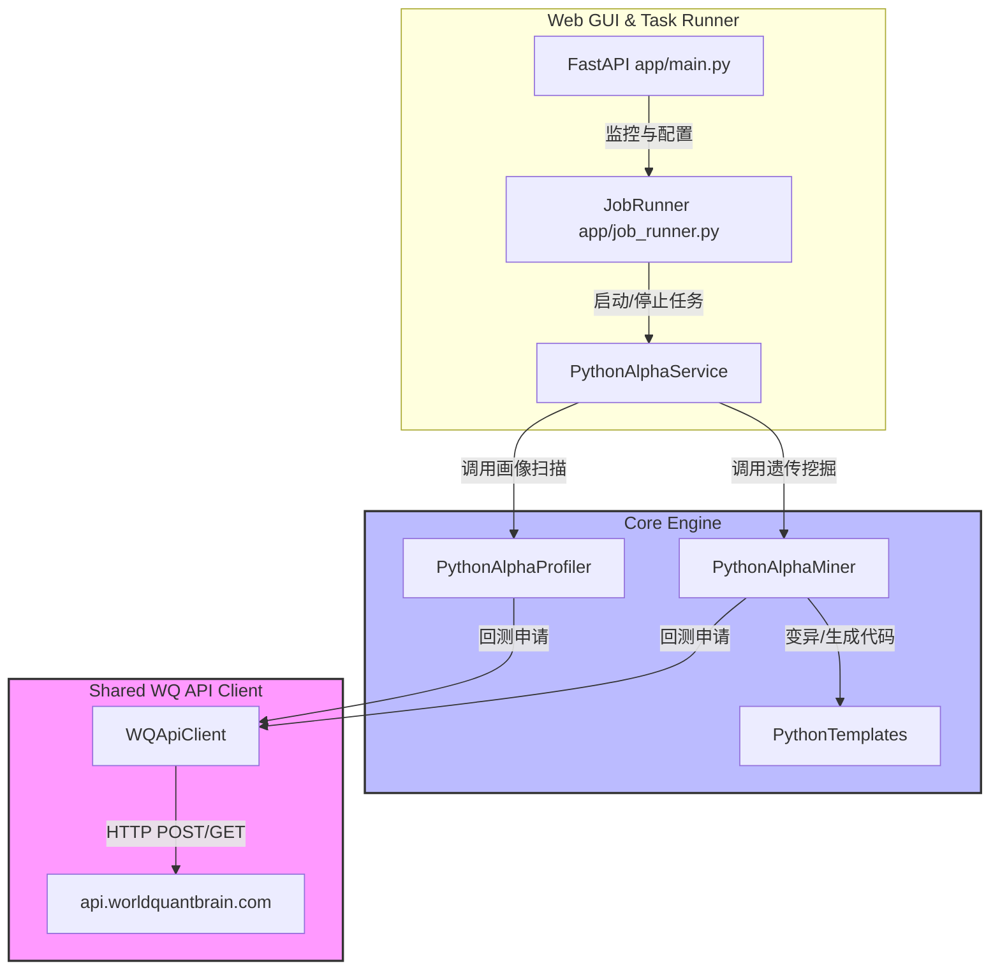

# WorldQuant BRAIN: Python Alphas 自动化挖掘与数据画像系统实施计划书

本计划书旨在详细规划 WorldQuant BRAIN **Python Alphas** 框架的落地与集成路径。我们将在现有 GUI 顾问系统上，以**高内聚低耦合**的架构，优先开发**想法 1（遗传算法智能进化挖掘器）**，随后实施**想法 2（数据画像 6 步自动扫描器）**。

---

## 目录
1. [项目目标](#1-项目目标)
2. [系统架构设计与解耦方案](#2-系统架构设计与解耦方案)
3. [核心模块详述](#3-核心模块详述)
   - [3.1 通用 API 客户端 (`WQApiClient`)](#31-通用-api-客户端-wqapiclient)
   - [3.2 Python 遗传进化挖掘器 (`python_alpha/miner.py`)](#32-python-遗传进化挖掘器-python_alphaminerpy)
   - [3.3 数据画像 6 步扫描流水线 (`python_alpha/profiler.py`)](#33-数据画像-6-步扫描流水线-python_alphaprofilerpy)
4. [分步实施里程碑（Milestones）](#4-分步实施里程碑milestones)
5. [验证与测试方案](#5-验证与测试方案)

---

## 1. 项目目标

1. **平台对接升级**：使 GUI 系统原生支持 WQ Brain 新版 Python 因子回测（指定 `'language': 'PYTHON'`）。
2. **代码完全解耦**：避免将复杂的 Python 脚本生成、变异逻辑与原有的单行 FastExpr 回测引擎混淆，保持代码库的整洁和可维护性。
3. **实现想法 1（智能因子挖掘）**：自动构建 Python 代码片段模板，通过遗传算法进行自动演化（变异、交叉），挖掘出高 Sharpe 值的 Python Alpha 因子。
4. **实现想法 2（自动数据画像）**：对解锁的每一个新数据字段进行覆盖度、频率、中枢、偏度等 6 步自动化扫描，输出元数据报告以指导挖掘算法。

---

## 2. 系统架构设计与解耦方案

为保证模块的独立性，我们将采用如下架构：



* **原有的 `machine_lib.py`**：保持其对 FastExpr 单行因子的支持，避免破坏现有回测任务。
* **独立的 API 交互层 (`WQApiClient`)**：作为一个独立的、无状态的类，仅负责底层 Session 维护、发送回测、等待轮询、获取回测报告。
* **独立的 Python 因子包 (`consultant_core/python_alpha/`)**：封装所有的 Python 因子模板、变异算法、以及画像分析器。

---

## 3. 核心模块详述

### 3.1 通用 API 客户端 (`WQApiClient`)
* **文件路径**：`d:\code\WorldQuant Brain\consultant\gui\consultant_core\wq_api_client.py`
* **类定义**：`class WQApiClient:`
* **核心接口**：
  * `login(username, password) -> requests.Session`：登录验证。
  * `submit_simulation(session, payload: dict) -> str`：提交回测请求，返回进度查询 Location URL。
  * `poll_simulation(session, progress_url: str) -> dict`：轮询直至回测完成或出错，自动处理 Retry-After。
  * `get_alpha_details(session, alpha_id: str) -> dict`：拉取包含夏普比率、换手率等在内的完整指标。
* **Payload Builder 示例**：
  ```python
  def build_python_payload(code_str: str, region: str, universe: str, neut: str, decay: int) -> dict:
      return {
          "type": "REGULAR",
          "settings": {
              "instrumentType": "EQUITY",
              "region": region,
              "universe": universe,
              "delay": 1,
              "decay": decay,
              "neutralization": neut,
              "truncation": 0.08,
              "pasteurization": "ON",
              "testPeriod": "P0Y",
              "unitHandling": "VERIFY",
              "nanHandling": "ON",
              "language": "PYTHON",  # 核心：指定为 Python 环境
              "visualization": False,
          },
          "regular": code_str  # Python 因子完整代码段
      }
  ```

---

### 3.2 Python 遗传进化挖掘器 (`python_alpha/miner.py`)
* **文件路径**：`d:\code\WorldQuant Brain\consultant\gui\consultant_core\python_alpha\miner.py`
* **核心原理**：
  * **DNA 表达**：一个 Python Alpha 被抽象为一个**算子链条**。例如：
    ```python
    # 模板代码段
    def generate(data):
        raw_signal = data.close / data.vwap  # 因子公式
        alpha = rank(raw_signal)              # 截面处理
        return ts_decay_linear(alpha, 10)     # 时序平滑
    ```
  * **变异算子 (Mutations)**：
    * **算子替换**：例如随机把 `rank` 变异为 `zscore`；把 `ts_decay_linear` 变异为 `ts_mean`。
    * **参数变异**：把平滑周期从 `10` 变异为 `5` 或 `20`（遵从“次优参数波峰”选择策略）。
    * **字段交叉**：从画像数据库中提取两个高相关性较低的字段进行加减乘除组合。
  * **遗传选择算法 (Genetic Selection)**：
    * **适应度 (Fitness)**：通过 API 回测拉取结果：$Fitness = Sharpe \times 0.6 + |Sharpe/Turnover| \times 0.4 - Penalty(if\ TVR > 70\%)$。
    * 每次进化迭代只保留 Fitness 最高的 Top 20% 因子作为下一代父本。

---

### 3.3 数据画像 6 步扫描流水线 (`python_alpha/profiler.py`)
* **文件路径**：`d:\code\WorldQuant Brain\consultant\gui\consultant_core\python_alpha\profiler.py`
* **具体做法**：
  * 编写特定的 6 步测试代码，每次调用 `WQApiClient` 提交测试回测：
    * **步1**：`data.FIELD` 测量整体覆盖度。
    * **步2**：`np.where(data.FIELD != 0, 1.0, 0.0)` 测量每日活跃覆盖。
    * **步3**：计算 `FIELD` 差分标准差确定更新周期（日频 / 季频）。
    * **步4**：探测最大/最小值，确定异常值边界。
    * **步5/6**：检测中枢漂移及数据分布偏度。
  * 自动将画像元数据写入 `data/profiling_records.db`，供进化挖掘器读取。

---

## 4. 分步实施里程碑（Milestones）

| 里程碑 | 目标与交付物 | 详细任务 |
| :--- | :--- | :--- |
| **Milestone 1**<br>底层解耦与 API 提炼 | 通用 `wq_api_client.py` 交付 | 1. 复制并封装鉴权、发送回测、轮询、拉取参数功能。<br>2. 剥离与 SQLite 和 UI 任务状态的耦合。<br>3. 交付独立的、不含业务逻辑的底层 API 客户端。 |
| **Milestone 2**<br>Python 回测跑通 | 成功提交首个 Python 因子 | 1. 在 `doc/` 或 `scratch/` 编写极简 Python Alpha 代码（如量价因子）。<br>2. 使用 `WQApiClient` 发起 `'language': 'PYTHON'` 回测。<br>3. 验证平台返回 `COMPLETE` 并成功读取夏普比率。 |
| **Milestone 3**<br>遗传进化挖掘器开发 | `python_alpha/miner.py` 交付 | 1. 编写 Python Alpha 模板文件。<br>2. 实现 AST 级别或字符串替换级别的变异逻辑。<br>3. 实现种群演化、淘汰及记录流水线。 |
| **Milestone 4**<br>数据画像流水线开发 | `python_alpha/profiler.py` 交付 | 1. 编写 6 步扫描测试 Payload 产生逻辑。<br>2. 数据画像结果自动入库并提供给挖掘器作为先验过滤条件。 |
| **Milestone 5**<br>GUI 系统集成与调度 | Web 端可视化与控制面板上线 | 1. 在 `app/job_runner.py` 中注册 Python 智能挖掘任务。<br>2. 前端添加任务配置 Modal 与进化过程的可视化报表展示。 |

---

## 5. 验证与测试方案

### 5.1 自动化测试
* 每一个里程碑完成后，在 `d:\code\WorldQuant Brain\consultant\gui\scratch\` 下编写测试脚本进行单元验证。
* **API 客户端测试**：编写验证脚本测试 `WQApiClient` 能否正确捕获密码错误、重连、以及限频等待。
* **Python Alpha 回测测试**：验证 `'language': 'PYTHON'` 的 Payload 是否百分之百能被 WorldQuant 接口编译和执行。

### 5.2 手动验证
* 部署至本地 GUI 运行，通过前端点击启动一个包含 10 个种群的 Python 因子 1 代进化任务，验证数据库中能正确记录子代的变异公式及 Sharpe 值。
