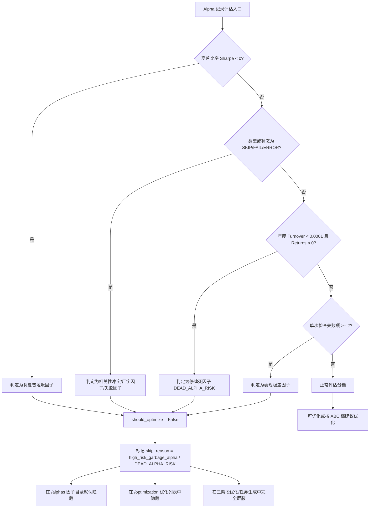
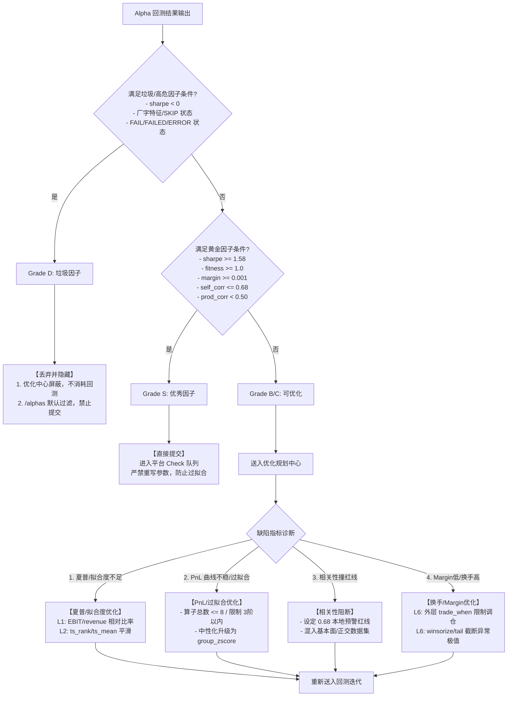
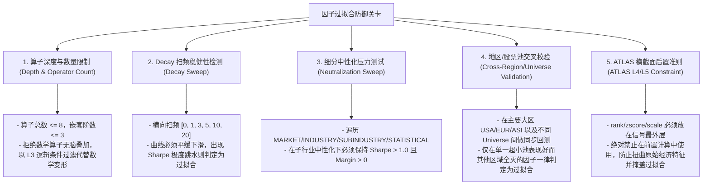
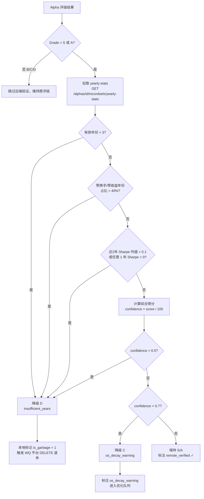

# WQ 黄金顾问团因子分类评估与优化策略指引

## 21. 负夏普与厂字垃圾因子隐藏与优化屏蔽机制 (Garbage Alphas Filtering)

为了保证平台的可用配额与本地优化效率，系统建立了“高危/垃圾因子识别、界面隐藏与优化屏蔽”机制。

### 21.1 垃圾因子定义与识别逻辑
 
垃圾因子（Garbage Alphas）指表现极差或存在严重相关性、有效性缺陷的因子。判定规则如下：
1. **负夏普因子**：`sharpe < 0` 的因子（无实际经济含义且表现极差）。
2. **厂字因子 / 相关性冲突因子**：在本地相关性检测或平台结果中被标记为 `alpha_type == 'SKIP'` 或 `status == 'SKIP'` 的因子。
3. **硬性失败因子**：运行结果或最新检查状态为 `FAIL`、`FAILED`、`ERROR`。
4. **停牌死因子 (DEAD_ALPHA_RISK)**：在年度分解数据中存在某年 `turnover < 0.0001` 且 `returns ≈ 0` 的情形，即 PnL 曲线在该年进入完全平坦（"厂字"）状态，说明因子已停止产生信号。此类因子与 WQ 平台关于持续有效性的要求相悖，直接判定为 Grade D 垃圾隐藏。如截图所示的 PnL 变平 + Turnover 归零即为典型特征。
5. **未来数据/未来函数泄漏检测**：表达式中含有独立的 `returns` 变量（独立词边界 `\breturns\b`，排除 `ts_returns` 等内置函数）。`returns` 代表未来的个股回报，在回测中引入此类变量会导致严重的 Look-ahead Leakage（前瞻性偏差），平台校验必挂，因此在本地会被识别为 DEAD_ALPHA_RISK 并标记为垃圾因子。
6. **交易样本过低**：因子在整个回测区间内覆盖的标的股票数量过低（如 `instrumentCount < 30`）。极低股票覆盖度通常表明条件过于苛刻或逻辑过拟合到少数个股上，线上检验将触发 LOW_INSTRUMENT_COUNT 或 MIN_INSTRUMENTS 失败，因此直接判定为 DEAD_ALPHA_RISK 并标记为垃圾因子。


### 21.2 评估与隐藏过滤流程



### 21.3 系统表现与操作规程
- **优化中心屏蔽**：所有判定为 `high_risk_garbage_alpha` 的因子在 `/optimization` 规划页面不予展示，亦不允许用户通过一键运行自动生成变体，防止浪费算力资源。
- **因子记录隐藏**：在 `/alphas` 页面默认对垃圾因子进行过滤隐藏。页面上提供 `显示隐藏因子` 的复选框（或追加 `?show_hidden=1` 参数），仅在用户手动选择开启时以灰色警告样式展示，方便追踪历史失败原因。
- **模板迭代过滤**：模板生成的迭代候选若包含已知无效的前缀或产生负夏普记录，会在 Preview 阶段直接根据 `BAD_FIELD` / `EXPRESSION_INVALID` 原因隐藏，不进入回测队列。


## 22. WQ 黄金顾问团因子分类评估与优化策略指引 (Factor Assessment & Optimization Guide)

本节基于黄金顾问团的实战沉淀（赛博游戏王、贺六浑、台湾第一等），构建了一套标准化的**因子状态评估决断矩阵与多维指标定向优化指引**，作为 GUI 判定算法与人工调参的底层知识库。

### 22.1 因子决断分类体系 (Decision & Grading Matrix)

回测任务结束后，系统及用户应根据 5 维客观数据（Sharpe, Fitness, Margin, Turnover, Correlation）对因子进行分档归类，执行不同路径：

| 因子类别 (档位) | 核心指标定义 | 诊断与成因分析 | 处置动作 (Action) |
| :--- | :--- | :--- | :--- |
| **高危垃圾因子**<br/>**(Grade D)** | - 负夏普: `sharpe < 0`<br/>- 厂字因子 (Flat PnL): 满足以下任一特征的因子：<br/>  1. 全零 PNL<br/>  2. 历史跨度不足 5年 (1260天)<br/>  3. 末端连续 250天等值<br/>  4. 中途包含连续 250天相同值<br/>  5. 存在连续 756天 (3年) 零值<br/>- 极致相关: `self_corr > 0.70`<br/>- 检查失败: `FAIL/FAILED/ERROR` | - 厂字因子本质上是由于数据漏洞或代码除 0/极值常数引发的“假因子”，线上提交必挂。<br/>- 负夏普说明没有任何经济学预测价值。<br/>- 撞车因子说明过拟合或缺乏独特信号。 | **直接丢弃，界面隐藏**。<br/>- 不在优化中心展示。<br/>- 彻底屏蔽自动或人工重回测，避免浪费平台配额。 |
| **可优化因子**<br/>**(Grade B / C)** | - 临界表现: `1.25 <= sharpe < 1.58`<br/>- 或收益率偏低: `0 < margin < 0.001`<br/>- 单项指标存在硬伤（如 `self_corr` 处于 0.68-0.70 临界线，近年表现衰退或换手率偏高） | - 因子蕴含了有效的预测特征，但由于算子堆砌或未中性化，导致风格/行业暴露过重。<br/>- 衰减系数 Decay 阻碍或调仓过于频繁，侵蚀了 Margin。 | **送入优化规划 (Go to Optimization)**。<br/>- 执行参数扫频测试。<br/>- 采用下方多维优化动作进行“改色”或“提纯”。 |
| **黄金优秀因子**<br/>**(Grade S)** | - 高表现: `sharpe >= 1.58`<br/>- 高适配: `fitness >= 1.0`<br/>- 高收益: `margin >= 0.001`<br/>- 强正交: `self_corr <= 0.68` 且 `prod_corr < 0.50` | - 代码逻辑极其精简，未产生过度拟合。<br/>- 蕴含独特的阿尔法源，与已提交的 OS 资产库相关度低。 | **直接提交 (Direct Submit)**。<br/>- 严禁进行大范围参数重写或增加算子层级（防止画蛇添足引入过拟合）。<br/>- 立即进入平台 Check 队列。 |

### 22.2 多维指标针对性优化动作 (ATLAS-based Optimization Tactics)

对于处于 **B / C 档**的“可优化因子”，应当根据指标短板，在 **ATLAS 6层表达式架构**下执行定向重构：

#### 1. 提升夏普比率与拟合度 (Sharpe & Fitness Enhancement)
* **算术层特征提炼 (L1 - Arithmetic)**：
  - 寻找更具经济学合理性的相对比率。例如：将原始财务值转换为 `divide(EBIT, revenue)` 或 `subtract(operating_income, interest_expense)`，避免直接使用非平稳宏观指标。
* **时序趋势平滑 (L2 - Time-Series)**：
  - 若因子短期内波动剧烈，使用 `ts_mean(alpha, 20)` 进行指数平滑。
  - 采用 `ts_rank(alpha, 252)` 代替原始数值输入，将时序转化为分位数，平抑极端异常值带来的伪高夏普。
* **逻辑条件分支 (L3 - Logic)**：
  - 使用 `if_else` 或 `greater_equal` 设定边界，仅在特定特征区间（如高动量、低波动）激活信号，剥离无信息量的白噪声。

#### 2. 优化 PnL 收益曲线与防止过拟合 (PnL Smoothing & Overfitting Defense)
* **Decay 衰减扫频压力检验**：
  - 对衰减因子执行 `[0, 1, 3, 5, 10, 20]` 双向参数扫频。
  - *判定*：如果 Sharpe 随 Decay 增大发生断崖式下跌，说明因子严重拟合超短期的高频流动性，实盘极易失效。
  - *动作*：降低表达式中的算子总数（`operator_count_max <= 8`，绝对禁止 3 阶以上的套娃算子），强制使用时序滑动平均进行物理去噪。
* **高级中性化升级 (L5 - Group)**：
  - 若回测结果的收益曲线在大盘风格切换时产生剧烈回撤，说明中性化层级不足。
  - 将横截面 `rank({field})` 升级为板块或细分行业内去偏：`group_zscore(rank({field}), {group})`，剥离风格集中度暴露。

#### 3. 相关性阻断与降低 (Correlation Mitigation)
* **本地相关性 0.68 预警线**：
  - 本地与平台官方后台存在约 2% 的计算截断误差，因此本地自相关限制应强制设定为 `0.68 - 0.70`。
* **正交信号混入 (L1 - Combination)**：
  - 将当前价量特征与基本面特征结合，如 `add(rank(pv_field), group_zscore(fundamental_field))`，利用不同低相关的数据源冲淡自相关。
* **时序降频与防撞车**：
  - 对自相关过高的因子，将 lookback 窗口延长（例如由 20 天调至 120 天），或使用 `ts_decay_linear(alpha, 10)`，使其收益与原有高频因子错峰。

#### 4. 提升 Margin 与降低换手 (Margin Improvement & Turnover Control)
* **调仓换手限制 (L6 - Transformation)**：
  - 换手率过高（如 `turnover > 0.70`）是侵蚀 Margin 的第一杀手。
  - 在表达式最外层包裹 `trade_when`（L6）：`trade_when(trigger_signal, alpha, 0)`。只有在触发条件（如波动率低于阈值）成立时才调仓，平时保持原有持仓权重。
* **尾部极值截断**：
  - 引入 `winsorize` 或 `tail` 算子剔除分布两端的离群值，防止小市值股票的暴涨暴跌扭曲投资组合权重，平滑换手曲线。

---

### 22.3 决断与优化流向知识图 (Mermaid Flowchart)

以下知识决策图清晰展示了从因子回测产出到分档处理、指标诊断以及定向优化的完整工作流，便于后续系统功能拓展：



### 22.4 WQ 黄金顾问团过拟合防护体系 (Overfitting Defense Framework)

过拟合（Overfitting）是因子挖掘与提交的第一杀手。偶尔的单点高夏普往往是由于对历史特定噪声的撞大运拟合。本系统基于黄金顾问团的 6 维综合视角设计了如下过拟合防御规程：



#### 1. 算子数量与嵌套深度硬上限
- **规则**：单个 Alpha 表达式的算子总数不得超过 8 个 (`operator_count <= 8`)，且嵌套层级（括号嵌套）不得超过 3 层。
- **成因**：平台（ATLAS 规则）会审查 `Operators per Alpha` 的均值。过高（如平均 > 8.0）会被算法标记为拟合度过载，导致降档。
- **改法**：精简数学变形（如嵌套的 `log`, `power`），采用 `trade_when` 或 `if_else` 进行阶段性逻辑控制（L3 算子）。

#### 2. Decay 扫频曲线倾斜度审查
- **规则**：因子必须在不同衰减参数 `Decay = [0, 1, 3, 5, 10, 20]` 下进行回测扫频。
- **指标阈值**：从 Decay=0 到 Decay=20，Sharpe 比率应呈现出平缓下滑。如果在 Decay=0/1 时夏普为 2.5，而在 Decay=3 时暴跌至 0.8 以下，判定为“超短期过拟合”。
- **成因**：说明因子只在今日预测明日极短瞬时价格波动中有效，极易受到交易佣金和实盘摩擦（Turnover 耗损）影响，实盘交易中没有存活空间。

#### 3. 颗粒度中性化压力测试
- **规则**：因子必须通过 `MARKET`、`SECTOR`、`INDUSTRY`、`SUBINDUSTRY`、`STATISTICAL` 等多层中性化测试。
- **指标阈值**：在最细粒度的 `SUBINDUSTRY`（子行业中性化）或 `STATISTICAL`（统计中性化/风格消偏）下，因子 Sharpe 必须保持在 1.0 以上，且 Margin 保持为正。
- **成因**：如果一个因子在中性化级别低时 Sharpe 高，而在行业中性化后 Sharpe 归 0，说明该因子本质上只是在赌行业贝塔或某些宏观风格暴露，并未捕获到真正的公司级超额收益（特异性阿尔法）。

#### 4. 地区与股票池交叉校验 (Cross-Validation)
- **规则**：计算资源应当集中在核心地区（如 USA/EUR/ASI）。一个在 USA D1 TOP3000 上勉强达标但换到 EUR 或 ASI 表现彻底塌方的因子，极大概率是过拟合产物。
- **处置**：优先保留在两个大区以上均表现稳健的模板结构，对于“宇宙单点因子”采取扣分或降档处理，防止平台合并（Combine）时发生剧烈回撤。

#### 5. ATLAS 横截面操作后置准则
- **规则**：`rank`、`zscore`、`scale` 等横截面归一化算子，必须作为信号输出前的最外层处理（L4/L5 级），绝对禁止作为底座前置处理。
- **成因**：前置横截面处理会扭曲底层的原始特征数据（如把绝对金额变为 0-1 排位值），使得后续的时序算子（L2）在错误的数据流上计算，极易因为分位数跳变产生严重参数过拟合，且在线上回测时容易发生撞车。

---

## 22. A 级以上因子远端二次验证规则（Remote IS/OS Validation）

> **触发条件**：评级结果为 **Grade A 或 Grade S** 的因子，必须进行远端拉取验证，防止厂字/过拟合/OS 崩塌因子混入提交队列。

### 22.1 Fitness 公式与过拟合判据

```
fitness = sharpe × √( |returns| / max(turnover, 0.125) )
```

**关键推论**：
- 若 `fitness > 2 × sharpe`，则意味着 `|returns| >> turnover`，收益率严重偏高 → **过拟合结构性预警**。
- IS 阶段 Sharpe 与 Fitness 差距越大，OS 衰减越剧烈。

### 22.2 年度统计接口 (`yearly-stats`) 逐年核查

**接口**：`GET https://api.worldquantbrain.com/alphas/{alpha_id}/recordsets/yearly-stats`

返回 `records` 数组，字段结构（从 schema.properties 动态解析）包含 `year`, `sharpe`, `returns`, `drawdown`, `turnover` 等。

#### 厂字因子检测阈值

| 检查项 | 不合格条件 | 判定动作 |
|--------|-----------|---------|
| 有效数据年份总数 | `< 3` 年 | 降级 D，标注 `insufficient_years` |
| 近 2 年 Sharpe | 任意 1 年 `sharpe == 0` 或 L2Y均值 `< 0.1` | 降级 D，标注 `DEAD_ALPHA_RISK_RECENT` |
| 零收益/零换手年份占比 | `zero_years / total_years > 40%` | 降级 D，标注 `DEAD_ALPHA_RISK` |
| 负收益年份占比 | `> 35%` | 降级 D；`> 10%` 则扣分降至 C |
| 正收益年份占比 | `< 50%` | 降级 D，标注 `unstable_returns` |
| L2Y Sharpe（近 2 年均值） | `< IS_Sharpe × 0.5` | 降级 C，标注 `os_decay_warning` |
| 年度 Turnover | 某年 `< 0.0001` 且 Returns `< 0.00001` | 降级 D，标注 `DEAD_ALPHA_RISK` |
| 最大回撤 | `> 15%` | 扣分，加注 `high_drawdown` |

#### 厂字 PNL 端点检测（逐日 PNL 接口补充验证）

**接口**：`GET https://api.worldquantbrain.com/alphas/{alpha_id}/recordsets/pnl`

日度 PNL 逐日分析通过以下五重检测全面过滤无效因子：
- **全局全零**：如果 PNL 序列的所有非 None 值均为 0 → 判定为 DEAD_ALPHA_RISK
- **历史跨度**：PNL 数据总交易日数量少于 3 年 (756天) → 判定为 DEAD_ALPHA_RISK
- **末端等值**：最近连续 250 天（约 1 年）PNL 完全等值不变（包括 None 以外的任何相同值） → 判定为 DEAD_ALPHA_RISK
- **中途冻结**：序列的任意段包含连续 250 天及以上的相同非零值 → 判定为 DEAD_ALPHA_RISK
- **零值断带**：序列包含连续 756 天（约 3 年）的零值 → 判定为 DEAD_ALPHA_RISK

### 22.3 综合 IS/OS 得分计算（远端验证综合评分）

```python
def compute_remote_validation_score(yearly_stats: list[dict], is_sharpe: float = 0.0, is_fitness: float = 0.0) -> dict:
    """
    yearly_stats: 已解析后的年度统计列表，每项含 year/sharpe/returns/turnover/drawdown
    """
    # 详见 app/services/alpha_remote_validator.py 中的实现
```

### 22.4 远端验证流程图



### 22.5 IS/OS 实战经验补充（来源：IQC Global Final 实战数据）

| 经验条目 | 核心规律 | 操作建议 |
|---------|---------|---------|
| OS/IS 比值普遍偏低 | 即使 Superalpha 级别，OS/IS 达到 0.3 的都很少 | 不要用 IS 指标直接判断 OS 质量 |
| 多样性是最强 OS 保护 | 多地区 + 多数据类型 + 多算子 = OS 稳定性最强 | 同一模板跑多区域，相关性低则保留 |
| Fitness >> 2×Sharpe → 危险 | 说明 returns 虚高，过拟合征兆 | `fitness / sharpe > 2` 时强制降级 C |
| `trade_when` 高风险算子 | 被明确指出为过拟合高危算子 | 带 `trade_when` 的因子额外附加稳健性扫频要求 |
| Turnover 控制 | Turnover > 15% 时性能急剧退化 | 建议 Turnover < 10%，最高不超过 15% |
| Decay 扫频 | 建议扫 `[0, 20, 22, 60, 120, 240]` | Sharpe 无极端崩塌才判定稳健 |

---
