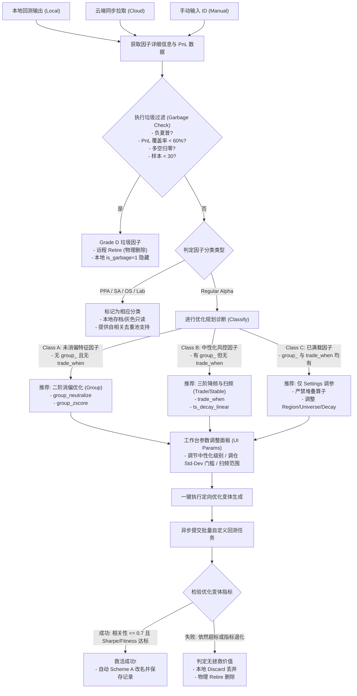

# 待优化因子分类与定向挽救升级指南 (Optimizable Alphas & Directed Salvage Guide)

本文档定义了因子生命周期中“可优化”与“绝对垃圾”因子的判定界限，详细说明了平台 Check 失败的诊断原因与定向拯救（巴斯德过滤、高换手率、自相关性高、夏普低以及多重并发交织缺陷）的改写动作，并将定向拯救的闭环可执行流程图载入其中。

---

## 1. 垃圾因子筛除标准 (Hard Discard - 坚决不予优化)

符合以下任意一条规则的因子被判定为 **Grade D (垃圾/无潜力因子)**。系统将直接触发 WQ 平台的 `Retire (物理退休)` 并在本地标记为 `is_garbage = 1` 予以隐藏，**不允许**进入优化规划流程：

1.  **负夏普 (Negative Sharpe)**：`sharpe < 0`。
2.  **停牌/厂字死因子 (Low PnL Coverage)**：
    *   回测 PnL 数据中，有收益率变化的交易日天数占比**低于 60%** (`pnl_coverage_rate < 0.60`)。
    *   任一完整年度的 `longCount == 0` 或 `shortCount == 0`（多空单侧归零）。
    *   任一完整年度的 `turnover < 0.0001` 且 `returns < 0.00001`（无换手且无收益）。
3.  **未来函数泄漏 (Future Leak)**：表达式中包含 `returns` 关键字。
4.  **样本过低 (Low Instrument Sample)**：活跃交易股票数 `instrumentCount < 30`。

---

## 2. 待优化因子三阶分类诊断 (3-Stage Classification)

对于非垃圾因子（`Sharpe >= 1.25` 且 `Fitness >= 1.0` 且 `is_garbage = 0`），系统在载入/导入时会提前在数据库字段 `alpha_class` 中打好分类标签，无需临时计算，保障零卡顿：

### Class A: 一阶/未消偏特征因子 (Raw Alphas)
*   **特征**：表达式中**没有** `group_` 系列算子（如 `group_neutralize`, `group_zscore`, `group_rank`）且**没有** `trade_when`。
*   **典型缺陷**：自相关系数超标；容易在局部板块或特定因子暴露上过度集中。
*   **优化逻辑**：二阶横截面板块消偏。

### Class B: 二阶/中性化风控因子 (Neutralized Alphas)
*   **特征**：表达式中**已包含** `group_` 系列算子，但**没有**最外层的 `trade_when`。
*   **典型缺陷**：行业已消偏，但调仓过密导致**换手率过高** (`turnover > 0.70`)；或在 Decay 扫频中出现夏普崩塌。
*   **优化逻辑**：三阶时序平滑与降频。

### Class C: 三阶/已满载因子 (Fully Optimized Alphas)
*   **特征**：表达式中**已同时包含** `group_` 系列算子和 `trade_when`。
*   **典型缺陷**：算子嵌套深度（ATLAS 算子数）已接近上限 (8~10 个)。
*   **优化逻辑**：**严禁**继续进行算子叠加（防范画蛇添足与复杂度超限），仅允许微调 settings（Region, Universe, Decay）进行扫频检验。

---

## 3. 定向拯救与优化可执行流程图



---

## 4. 特定平台 Check 失败类型诊断与针对性挽救策略 (Salvage Tactics)

当因子未能通过平台 Check 审查时，系统会基于错误日志自动匹配对应的诊断并推荐改写算子：

### 4.1 巴斯德过滤失败 (PASTEURIZATION)
*   **失败诊断**：因子的数值分布极度稀疏、或存在大范围长时间连续常数值（阶梯状），导致最终计算出的有效交易股票池低于阈值。
*   **挽救策略**：
    1.  **分位数转换**：使用 L2 时序算子 `ts_rank(alpha, days)` 将其转换为横向/时序的均匀分布，抹平数值集中块。
    2.  **噪声抖动混入**：引入微小的均匀分布随机扰动破坏常数截断：`add(alpha, multiply(rand_uniform(), 1e-6))`。
*   **改写示例**：
    *   原始：`close`
    *   改写：`ts_rank(close, 20)`

### 4.2 自相关性高 (SELF_CORRELATION)
*   **失败诊断**：因子与同账号下已成功提交的在线 OS 因子产生损益共振（Pearson 相关系数 $> 0.70$），或因子自身的时序依赖过深。
*   **挽救策略**：
    1.  **行业消偏 (ATLAS L5)**：叠加 `group_neutralize(alpha, subindustry)`，剥离共同暴露的板块 Beta，挖掘正交阿尔法。
    2.  **横截面去噪**：叠加 `group_zscore` 去除截面上的板块离群暴露。
*   **改写示例**：
    *   原始：`close`
    *   改写：`group_neutralize(close, subindustry)`

### 4.3 换手率高 / 衰减敏感 (DECAY_SENSITIVE / HIGH_TURNOVER)
*   **失败诊断**：因子仅在超高频 (Decay=0/1) 状态下有效，因调仓过密在 Decay 扫频 (Decay=3/5) 时夏普跳水，或者因年化换手率 $> 70\%$ 被阻断。
*   **挽救策略**：
    1.  **时序平滑平铺**：采用时序线性衰减算子 `ts_decay_linear(alpha, 10)` 平摊调仓信号。
    2.  **波动率调仓条件限制 (ATLAS L6)**：在最外层包裹 `trade_when(condition, alpha, -1)` 触发门槛，仅在资产发生显著异动（波动率 Std-Dev 超过阈值）时换仓。
*   **改写示例**：
    *   原始：`A`
    *   改写：`trade_when(greater(ts_std_dev(A, 5), 0.01), A, -1)`

### 4.4 夏普比率偏低 / 信号反向 (LOW_SHARPE)
*   **失败诊断**：因子具有预测能力，但由于表达式未中性化或多空信号颠倒，导致单点 Sharpe 比率未达标（$< 1.25$）。
*   **挽救策略**：
    1.  **信号翻转**：乘上负号翻转做空信号：`multiply(alpha, -1)`。
    2.  **局部中性化升级**：运用 `group_zscore(alpha, sector)` 等进行局部消偏。
*   **改写示例**：
    *   原始：`A`
    *   改写：`group_zscore(multiply(A, -1), subindustry)`

---

## 5. 多重并发缺陷交织因子的级联拯救重写方案 (Compound Cascade Salvage)

在实战中，常常出现一个因子**同时不满足好几种条件**（例如：既由于存在大范围常数触发巴斯德过滤失败，又在 Decay 扫频中极度敏感导致换手率偏高，同时与 OS 库的自相关性达到了 0.76 的危险红线）。

针对此类**多重并发交织**的情况，不能仅用单一算子改写，而必须遵循 **「自底向上，层层防护」的级联拯救重写模型 (ATLAS Cascade Rewrite Model)**：

### 5.1 级联改写三阶段策略 (3-Stage Cascading Tactics)

```text
  [ 输出: 最终级联拯救 Alpha ]
             ▲
             │ L6 信号转换 (限制换手与调仓)
   [ trade_when / ts_decay_linear ]
             ▲
             │ L5 板块分组 (剥离行业相关共性)
        [ group_neutralize ]
             ▲
             │ L2/L4 格式转换 (平抑极端分布，通过巴斯德)
         [ ts_rank / zscore ]
             ▲
             │
      [ 输入: 原始缺陷核心 ]
```

1.  **第 1 步 (解决巴斯德与分布稀疏问题)**：
    首先利用 L2/L4 横截面算子对原始缺陷表达式进行分布变换，将其强制均匀分位化，以扩充有效交易样本数量并平抑异常常数值。
    *   动作：`ts_rank(Core, 20)`
2.  **第 2 步 (解决自相关与行业集中问题)**：
    在第 1 步的分位数信号基础之上，在其外层嵌套 L5 级分组算子，强制剥离其在 subindustry/industry 下的行业多头共振，实现相关性下降。
    *   动作：`group_neutralize(ts_rank(Core, 20), subindustry)`
3.  **第 3 步 (解决高换手与衰减敏感度问题)**：
    在第 2 步完成了行业中性化的信号之上，最外层使用 L6 级信号转换算子进行平滑与调仓限制。叠加时序 Decay 以抵抗时间滑点，并叠加 `trade_when` 使得在波动率平缓期间保持当前仓位不变（`-1`），大幅抑制高昂的 Turnover。
    *   动作：`trade_when(greater(ts_std_dev(group_neutralize(...), 5), 0.01), group_neutralize(...), -1)`

### 5.2 多重拯救黄金改写模板

对于多重并发因子，其统一的推荐改写形态如下：

$$Alpha_{rescued} = \text{trade\_when}\left(\text{greater}\left(\text{ts\_std\_dev}(A_{smooth}, 5), 0.01\right), A_{smooth}, -1\right)$$

其中：

$$A_{smooth} = \text{ts\_decay\_linear}\left(\text{group\_neutralize}\left(\text{ts\_rank}(\text{Core}, 20), \text{subindustry}\right), 10\right)$$

此级联重写算子包含了 **ATLAS 体系的 L2, L5, L6 层全部风控设计**，在实战中可同时解决 Pasteurization 失败、自相关超标与换手率过高的三大顽疾，完成极限抢救。
