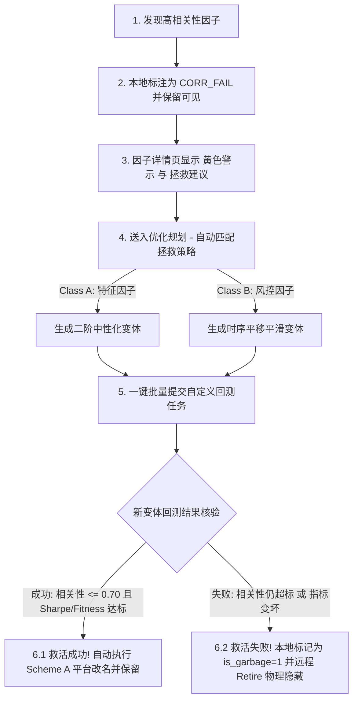

# 待优化因子分类与高相关性因子拯救流程规范 (Optimizable Alphas & Decorrelation Workflow)

本文档定义了因子生命周期中“可优化”与“绝对垃圾”因子的判定界限，并针对“高相关性因子”制定了定向标注、变体拯救与闭环淘汰的工作流规范，供后续回测任务与优化规划模块直接调用。

---

## 1. 垃圾因子筛除标准 (Hard Discard - 坚决不予优化)

符合以下任意一条规则的因子被判定为 **Grade D (垃圾/无潜力因子)**。系统将直接触发 WQ 平台的 `Retire (物理退休)` 并在本地标记为 `is_garbage = 1` 予以隐藏，**不允许**进入优化规划流程：

1.  **负夏普 (Negative Sharpe)**：`sharpe < 0`。
2.  **停牌/厂字死因子 (Low PnL Coverage)**：
    *   回测 PnL 数据中，有收益率变化的交易日天数占比**低于 60%** (`pnl_coverage_rate < 0.60`)。
    *   任一完整年度的 `longCount == 0` 或 `shortCount == 0`（多空单侧归零）。
    *   任一完整年度的 `turnover < 0.0001` 且 `returns < 0.00001`（无换手且无收益）。
3.  **未来函数泄漏 (Future Leak)**：表达式中包含 `returns` 关键字。
4.  **样本过低 (Low Instrument Sample)**：活跃交易股票数 `instrumentCount < 30`。

---

## 2. 待优化因子分类与改写逻辑 (Optimizable Alphas - 3-Stage Classification)

对于非垃圾因子（`Sharpe >= 1.25` 且 `Fitness >= 1.0` 且 `is_garbage = 0`），根据其算子层级与结构特征，分为以下三个梯队，并匹配不同的回测优化任务：

### Class A: 一阶/未消偏特征因子 (Raw Alphas)
*   **特征**：表达式中**没有** `group_` 系列算子（如 `group_neutralize`, `group_zscore`, `group_rank`）且**没有** `trade_when`。
*   **典型缺陷**：自相关系数超标 (`self_corr > 0.7` 或 `prod_corr > 0.7`)；容易在局部行业过度集中。
*   **优化逻辑 (二阶板块消偏优化)**：
    *   **中性化改写**：套入 `group_neutralize(alpha, subindustry)`，剥离行业和风格共性暴露。
    *   **板块内去偏**：套上 `group_zscore` / `group_rank`。
*   **改写模板代码实现**：
    ```python
    def get_class_a_variants(exp, group="subindustry"):
        return [
            (f"group_neutralize({exp}, {group})", f"group:neutralize_{group}"),
            (f"group_zscore({exp}, {group})", f"group:zscore_{group}"),
            (f"group_rank({exp}, {group})", f"group:rank_{group}")
        ]
    ```

### Class B: 二阶/中性化风控因子 (Neutralized Alphas)
*   **特征**：表达式中**已包含** `group_` 系列算子，但**没有**最外层的 `trade_when`。
*   **典型缺陷**：行业已消偏，但调仓过密导致**换手率过高** (`turnover > 0.70`)；或在 Decay 扫频中对衰减过度敏感。
*   **优化逻辑 (三阶时序平滑与降频优化)**：
    *   **调仓频率限制 (降 Turnover)**：叠加 `trade_when(greater(ts_std_dev(alpha, 5), 0.01), alpha, -1)`。
    *   **时序平滑平铺**：改写叠加 `ts_decay_linear(alpha, 10)` 进行平滑。
*   **改写模板代码实现**：
    ```python
    def get_class_b_variants(exp):
        return [
            (f"trade_when(greater(ts_std_dev({exp}, 5), 0.01), {exp}, -1)", "trade:vol_std_gate"),
            (f"trade_when(greater(volume, ts_mean(volume, 20)), {exp}, -1)", "trade:volume_mean_gate"),
            (f"ts_decay_linear({exp}, 10)", "stable:decay_linear_10"),
            (f"ts_decay_linear({exp}, 20)", "stable:decay_linear_20")
        ]
    ```

### Class C: 三阶/已满载因子 (Fully Optimized Alphas)
*   **特征**：表达式中**已同时包含** `group_` 系列算子和 `trade_when`。
*   **典型缺陷**：算子数接近上限 (8~10 个)，表现出微弱的自相关超限或局部指标不达标。
*   **优化逻辑 (无算子叠加的微调)**：
    *   **严禁**在其上继续进行任何算子嵌套（防范画蛇添足与复杂度超限）。
    *   仅允许微调 Settings (如更换 Region、重载 Universe、微调 Decay 扫频)。
    *   若微调后仍无法通过，则直接标记为不可拯救并丢弃。

---

## 3. 高相关性因子 (HIGH_CORRELATION) 定向拯救工作流

对于其他指标表现优异（如 `Sharpe >= 1.25`）但由于自相关性超标（`prod_corr >= 0.70` 或 `self_corr > 0.70`）未能通过核验的因子，系统执行以下定向拯救流程：

### 3.1 流程图 (Workflow)



### 3.2 步骤详解

1.  **本地标注与保护**：
    *   在同步与巡检中，若因子的自相关性超标，系统不将其定级为 `D`，而是**定级为 `C`**（或保留其原评级），并将状态更改为 **`CORR_FAIL`**，设置 `is_garbage = 0`。
    *   此举确保该因子不会被远程 Retire 删除，在主页面和优化规划网格中仍然可见。
2.  **前端警示与操作入口**：
    *   **因子详情页**：针对状态为 `CORR_FAIL` 的因子，顶部以黄色醒目框提示：“⚠️ 自相关性超标 (当前: X.XX)，无法直接提交。建议通过中性化或时序平移降低相关性。”并提供一键跳转「生成优化变体」的入口。
3.  **定向改写变体生成 (Decorrelate Mode)**：
    *   **若为 Class A**：生成对应的行业中性化（`group_neutralize(alpha, subindustry)`）等 4~6 个改写变体。
    *   **若为 Class B**：生成对应的时序平移平滑变体（`ts_decay_linear(alpha, 5/10)`）。
4.  **自定义批量回测与收尾 (Evaluation & Pruning)**：
    *   用户选择生成的变体并提交批量回测。
    *   **回测成功收口**：若改写后的因子相关性下降到 `0.70` 以下，且各项指标（Sharpe, Fitness）依然合格，则该新因子救活成功，系统自动按 Scheme A 命名法进行重命名，并允许提交。
    *   **回收与清理**：如果所有优化变体运行后指标均变差，或者相关性仍居高不下，用户或系统可一键执行 **「丢弃 (Discard)」**，此时将该因子标记为 `is_garbage = 1` 并在云端安全退休删除，不占用资源。
