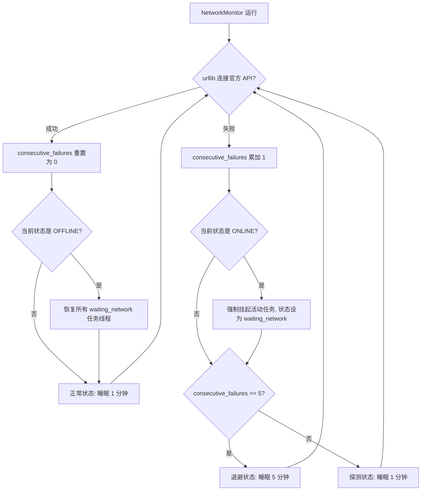

# D档垃圾因子平台物理隐藏与 Check 失败定向挽救机制

## 23. D档垃圾因子平台物理隐藏与 Check 失败定向挽救机制

本节明确了 Grade D (D档) 因子在 WorldQuant Brain 平台上的退休隐藏规范，以及针对特定 Check 失败的抢救/优化重写路径，确保本地决策与平台状态实时同步。

### 23.1 平台物理隐藏机制 (DELETE Simulations)

为了维护云端模拟队列的整洁，并防止重复回测或混淆历史记录，Grade D 因子必须从平台“物理退休”：
- **触发条件**：
  1. 在【批量回测】的 `save_children_alphas` 流程中，若子模拟结果的基本指标（如 `sharpe < 0`）触发 Grade D 评级。
  2. 在【提交检查】的 `check_worker` 流程中，当平台返回 `FAIL`（如自相关超限、Pasteurization 失败）且最终评估为 Grade D 时。
- **物理接口**：
  - 系统使用账号凭证的 Session，自动向 WQ 发送 `DELETE https://api.worldquantbrain.com/simulations/{alpha_id}` 请求。
  - WQ 接收后会将该模拟记录从云端删除/隐藏，确保研究员在云端 Alphas 视图中不再看到这些失败的垃圾尝试。
- **本地保留**：
  - 本地数据库中仍会以 `is_garbage = True` / `status = CHECKED_FAIL` 形式灰色保留该记录及其失败原因（`skip_reason = high_risk_garbage_alpha`），方便用户审计历史并避免重复挖掘。

### 23.2 Check 失败可挽救类型与优化重写规则 (Salvage Tactics)

并非所有的 Grade D 因子都是绝对的“死代码”。对于特定类型的平台 Check 失败，系统建立了如下**定向拯救/优化重写模板**：

| Check 失败类型 | 失败原因诊断 | 挽救改写动作 (L1 - L6) | 优化示例 |
| :--- | :--- | :--- | :--- |
| **`PASTEURIZATION`** (巴斯德过滤失败) | 因子值分布过于集中、稀疏，或存在大范围常数值，导致有效交易股票不足。 | **添加随机扰动/时序分位数变换**： 1. 外层叠加 `ts_rank(alpha, days)` 强制转化为均匀分布。 2. 混入微小噪音抖动破坏常数序列：`add(alpha, multiply(rand_uniform(), 1e-6))`。 | 原始: `close` 改写: `ts_rank(close, 20)` |
| **`LOW_SHARPE`** (低夏普过滤失败) | 因子信号本身有效，但反向或者存在极强的板块风格偏移，导致未消偏夏普偏低。 | **信号翻转与行业中性化 (L5)**： 1. 若 Sharpe 为负（如 -1.3），使用 `multiply(alpha, -1)` 翻转信号。 2. 使用 `group_neutralize(alpha, sector)` 强制剥离行业集中度暴露。 | 原始: `A` 改写: `group_zscore(multiply(A, -1), sector)` |
| **`CONSECUTIVE_IDENTICAL_RETURNS`** (连续相同回报失败) | 因子输出长时间卡在某个常数值（如触发除 0 保护被截断为上限），产生“厂字”折线收益。 | **除零安全防护与平滑**： 1. 将 `divide(A, B)` 替换为安全除法：`divide(A, add(B, 1e-8))`。 2. 叠加 `ts_decay_linear(alpha, 5)` 平滑阶梯信号。 | 原始: `divide(close, volume)` 改写: `ts_decay_linear(divide(close, add(volume, 1e-8)), 5)` |
| **`DECAY_SENSITIVE`** (衰减敏感度失败) | 因子仅在超高频 (Decay=0/1) 有效，由于调仓过密，夏普在 Decay=3 崩塌，换手率极高。 | **换手率控制与时序降频 (L6)**： 1. 在表达式最外层包裹 `trade_when` 条件触发器限制调仓频率。 2. 替换为大窗口时序平滑算子，如 `ts_decay_linear(alpha, 10)`。 | 原始: `A` 改写: `trade_when(greater(ts_std_dev(A, 5), 0.01), A, 0)` |

### 23.3 网络断开守护与自适应退避重连机制 (Network Monitor & Reconnection)

为了保证长周期任务（如批量回测、自动迭代与Checks提交任务）的高可用性，系统配备了网络监视器线程 (`NetworkMonitor`)。在发生网络故障时，系统会自动保护当前进度并在重连后自适应恢复。

#### 23.3.1 断线自动挂起与恢复流程
1. **自动探测**：后台以独立守护线程运行，定期向 WorldQuant Brain API 发起 HTTP 请求探测连通性。
2. **被动挂起 (Suspension)**：若由于网络丢包、官方维护或限流导致 API 连通中断，系统会触发 `runner.pause_job` 并将当前所有运行任务状态修改为 `waiting_network`，同时写入 `job_events` 警告事件。这释放了并发连接与资源，防止网络异常引发数据库死锁。
3. **自动重启 (Resumption)**：一旦网络监视器检测到连通恢复，将自动检索所有处于 `waiting_network` 的任务，重新调用 `runner.start_job` 进行无缝续传。对于用户之前手动暂停 (`paused`) 或已完成 (`completed`) 的任务，系统将保持其原始状态，不会自动重启。

#### 23.3.2 自适应退避轮询策略 (Adaptive Backoff Polling)
为了在“高频连接灵敏度”与“降低无用探测负荷”之间取得最佳平衡，轮询监测使用**自适应探测退避策略**：
- **正常状态下 (ONLINE)**：每 **1 分钟 (60秒)** 轮询一次。一旦连通成功，重试失败计数器立刻**清零重置**。
- **异常重连中 (OFFLINE)**：
  - **连续失败 < 5 次**：依然保持每 **1 分钟 (60秒)** 的高频探测，确保瞬断网络能被第一时间捕获并恢复任务。
  - **连续失败 >= 5 次**：判定为中长期断网，检测频率自动降低退避至每 **5 分钟 (300秒)** 一次，以规避网络拥堵或被官方服务器安全防护拦截。

