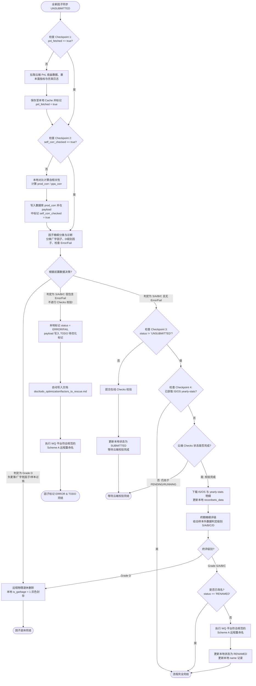

# 优化巡检与 Checks 级联分类流程图设计 (Alpha Inspection Workflow Design)

本文档根据「黄金顾问团」规范与实战反馈，重新梳理了因子从“回测成功”到“线上校验与命名”的精细化生命周期流程。本设计核心解决了三个痛点：
1.  **避免中途暂停/重启后重复二次检查**：引入本地数据库与 `payload` 过程状态标识（Checkpoint Flags）。
2.  **前置拉取所有详情与自相关计算**：在 Checks 提交前，先进行“拉取 PnL 数据、时序指标与仿真状态”（类似详情页的“加载时序与图标数据”），完整获取 checks 前的全部数据。
3.  **阻断 Error/Fail 因子校验并归档 TODO**：在初评阶段对数据进行彻底分类（厂字死因子、Grade D 垃圾因子、仿真 Error/Fail 因子）。若属于 S/A/B/C 级别但存在 Error 或 Fail 的因子，**坚决不提报 Checks 校验**，直接执行 Scheme A 远程改名，并在本地及 `/doc` 文档中双重标注 `TODO` 留待后续优化拯救。

---

## 1. 底层过程状态标识与 Checkpoint 设计

为保障任务即使被用户强行“暂停”或“服务器重启”后，重新启动能瞬间跳过已处理因子，我们设计了如下标识逻辑：

*   **时序与指标数据拉取标识 (`pnl_fetched`)**：
    *   在下载完因子 PnL 数据、详情 JSON 并确认存入本地 Cache 后，在 payload 中写入 `"pnl_fetched": true`。
    *   *作用*：中途重启将**直接跳过** PnL 和详情数据重复下载。
*   **本地自相关性检查标识 (`self_corr_checked`)**：
    *   在完成本地自相关性计算后，在 payload 中写入 `"self_corr_checked": true`。
    *   *作用*：中途重启将**直接跳过**自相关性比对计算。
*   **Checks 提报状态标识 (`status`)**：
    *   若因子无 Error 且初评为 S/A/B/C，提报 Checks 后本地 `status` 变更为 `SUBMITTED` 或 `CHECKING`。
    *   *作用*：中途重启将**直接跳过**重复提报。
*   **IS/OS 分解数据抓取标识 (`yearly-stats`)**：
    *   Checks 完成后（`CHECKED_PASS`/`CHECKED_FAIL`），拉取 OS/IS `yearly-stats` 数据并封入 payload。
    *   *作用*：中途重启将**直接跳过**终评与改名。
*   **错误隔离与双重 TODO 标注**：
    *   若因子初评为 S/A/B/C，但拉取数据中包含 `ERROR` 或 `FAIL`（如仿真状态异常）：
        *   **不提报 Checks 校验**（阻断）。
        *   **本地标注**：设置数据库 `status` 字段为 `ERROR` 或 `FAIL`，并在 payload 中写入 `"todo": "optimize_later"` 标签。
        *   **文档标注**：自动向新辟文件夹 `/doc/todo_optimization/factors_to_rescue.md` 写入该因子详情（因子 ID、公式、错误原因），方便后续集中优化。
        *   **改名保留**：同步触发 Scheme A 远程重命名，方便在 WQ 云端直观查看。

---

## 2. 垃圾筛选标准与 ERROR 隔离规则 (初评阶段)

*   **垃圾/D级因子（直接退休）**：
    使用 `/doc` 下已有规则判定是否为 Grade D。若是，直接触发 `Retire` 并置 `is_garbage = 1`：
    1.  `sharpe < 0`（负夏普）。
    2.  `pnl_coverage_rate < 0.60`（时序收益率覆盖率不足，停牌死因子）。
    3.  任一完整年度的多空单侧归零（`longCount == 0` 或 `shortCount == 0`）。
    4.  未来函数泄漏（表达式包含 `returns` 关键字）。
    5.  活跃交易股票数 `instrumentCount < 30`。
*   **Error / Fail 因子（隔离，改名，TODO 标记）**：
    若级别在 S/A/B/C 范围内，但仿真日志中包含 Error 或 Fail，**禁止提交 Checks 校验**。执行远程改名，本地标为 `ERROR`/`FAIL` 状态并写入 `factors_to_rescue.md` TODO 列表中。

---

## 3. 因子生命周期级联分类具体流程图

