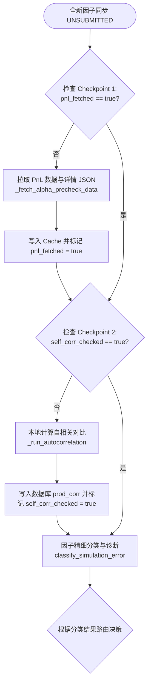
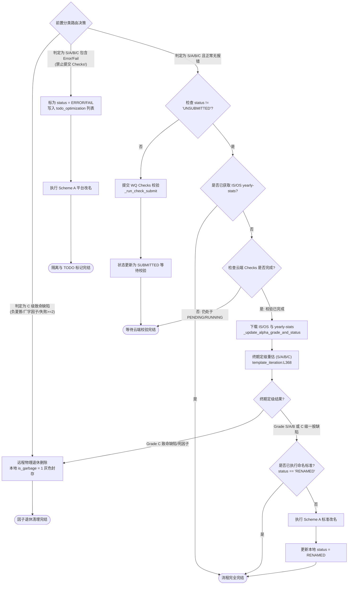

# 优化巡检与 Checks 级联分类流程图设计 (Alpha Inspection Workflow Design)

本文档制定了因子从回测完成入库 (`UNSUBMITTED`) 到提交 Checks 校验、拉取样本外与自相关性指标、最终完成 S/A/B/C 四档分类与退休清理的全自动级联流水线规范。所有核心判断逻辑与动作均通过可点击的 Markdown 链接直接关联到源码物理行。

---

## 1. 底层过程状态标识与 Checkpoint 设计

为保证巡检器在长时间运行、网络中断或系统重启时能具备高可用且不重复消耗 API 配额，在 `payload` 中设计了状态标识（Checkpoint Flags）：

*   **时序与指标数据拉取标识 (`pnl_fetched`)**：
    *   在下载完因子 PnL 数据、详情 JSON 并确认存入本地 Cache 后，在 payload 中写入 `"pnl_fetched": true`。具体实现参见 [_fetch_alpha_precheck_data](file:///d:/code/WorldQuant%20Brain/consultant/gui/app/services/background_inspector.py#L147) 与 [_run_fetch_pnl_details](file:///d:/code/WorldQuant%20Brain/consultant/gui/app/services/background_inspector.py#L515)。
*   **本地自相关性检查标识 (`self_corr_checked`)**：
    *   对符合条件（S 级及以上）的因子完成本地自相关对比计算后，写入 `"self_corr_checked": true`。具体参见 [_run_autocorrelation](file:///d:/code/WorldQuant%20Brain/consultant/gui/app/services/background_inspector.py#L460)。
*   **Checks 提报状态标识 (`status`)**：
    *   若因子无 Error/Fail 且符合 S/A/B 档位标准，提报 Checks 校验后本地状态更新为 `SUBMITTED` 或 `CHECKING`。参见 [_run_check_submit](file:///d:/code/WorldQuant%20Brain/consultant/gui/app/services/background_inspector.py#L413)。
*   **IS/OS 分解数据抓取标识 (`yearly-stats`)**：
    *   Checks 完成后 (`CHECKED_PASS`/`CHECKED_FAIL`)，自动下载逐年 IS/OS 统计数据入库。参见 [_update_alpha_grade_and_status](file:///d:/code/WorldQuant%20Brain/consultant/gui/app/services/background_inspector.py#L611)。

---

## 2. 垃圾筛选标准与 ERROR 隔离规则 (初评阶段)

在初评与核验前置处理中，系统执行严格的缺陷分类与隔离 ([classify_simulation_error](file:///d:/code/WorldQuant%20Brain/consultant/gui/app/services/background_inspector.py#L127))：

*   **C级致命缺陷因子/死因子（直接物理退休）**：
    若符合以下条件之一，定级重估为 **C 级 (致命缺陷)**，触发 WQ 平台物理删除 (`DELETE /simulations/{id}`) 并在本地标记 `is_garbage = 1` 灰化隐藏。实现见 [_run_retire](file:///d:/code/WorldQuant%20Brain/consultant/gui/app/services/background_inspector.py#L443) 与 [物理退休触发判断](file:///d:/code/WorldQuant%20Brain/consultant/gui/app/services/background_inspector.py#L670)：
    1.  `sharpe < 0`（负夏普收益率）。
    2.  `pnl_coverage_rate < 0.60`（时序收益率覆盖率不足，停牌死因子）。
    3.  任一完整年度的多空单侧归零（`longCount == 0` 或 `shortCount == 0`）。
    4.  单次检查失败项 >= 2（严重表现缺陷）。

*   **Error / Fail 因子（隔离，改名，TODO 标记）**：
    若级别在 S/A/B/C 范围内，但仿真日志中包含 Error 或 Fail，**禁止提交 Checks 校验**。执行远程改名，本地标为 `ERROR`/`FAIL` 状态并写入 `factors_to_rescue.md` TODO 列表中。
    *   **本地标注**：设置数据库 `status` 字段为 `ERROR` 或 `FAIL`，并在 payload 中写入 `"todo": "optimize_later"` 标签。
    *   **文档标注**：自动向文件夹 `/doc/todo_optimization/factors_to_rescue.md` 写入该因子详情。
    *   **改名保留**：同步触发 Scheme A 远程重命名，方便在 WQ 云端直观查看。

---

## 3. 因子生命周期级联分类具体流程图

为了清晰且复用，流程分为**前置核查流程**与**定级退休流程**两个模块化子流程图。

### 3.1 前置核查与数据补齐流水线

### 3.2 路由决策、Checks 提交与终期定级

