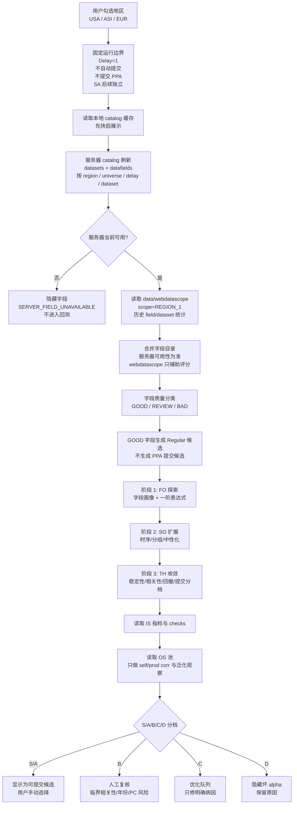
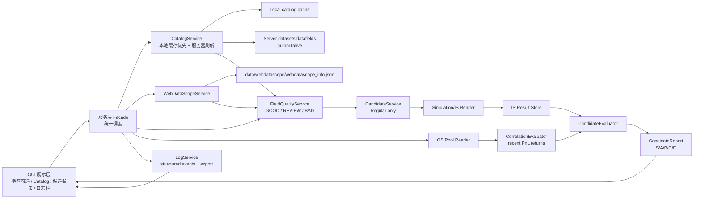
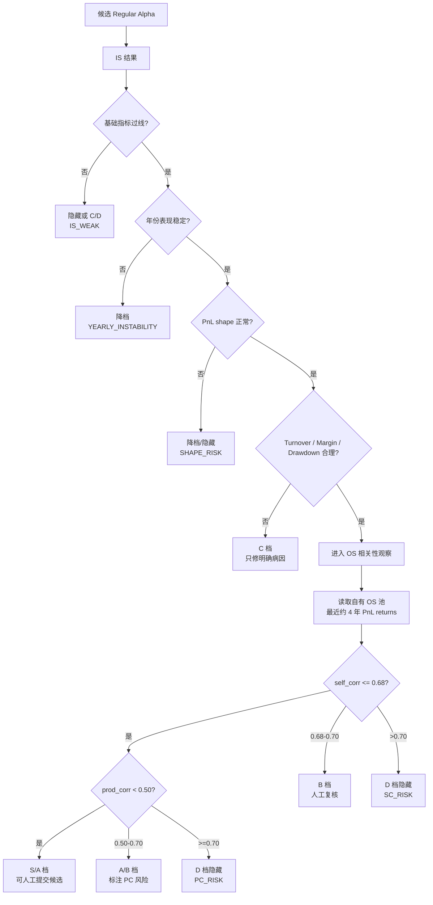

# 候选提交展示与总原则流程

# WQ 候选提交展示、数据错误处理与三阶段优化流程

更新时间：2026-06-29

范围：本文用于重新设计 WorldQuant Brain Consultant GUI 的候选因子展示、字段 catalog、数据集处理、错误处理、三阶段优化、日志导出与人工提交决策。当前版本不自动提交；固定考虑 `USA / ASI / EUR`、`Delay=1(D1)`；不提交 PPA；SA/Super Alpha 后续单独做。

重要边界：
- 服务器 catalog、字段权限、settings 选项、check 结果、提交状态永远以平台实时返回为准。
- `data/webdatascope` 只做历史统计辅助，不替代服务器可用性判断。
- GUI 只显示“哪些可以提交、为什么、风险在哪、建议动作是什么”，最终是否提交由用户手动选择。
- 没有在 skill 或本地资料中确认的规则，不写死为系统规则，只进入 TODO。

## 资料

可以使用 C:\Users\31186\.gemini\antigravity\skills\worldquant-brain-cyber-game-king\SKILL.md
        C:\Users\31186\.gemini\antigravity\skills\wq-top-advisors-skill\SKILL.md
        当作基础知识，如果有不懂的话  

## 0. 2026-06-29 冲突审计与 Goal 执行版

本节覆盖旧文档中的冲突表述，作为后续 goal 模式执行入口。旧章节仍保留作背景，但执行时以本节和后续 TODO 为准。

### 0.1 已确认冲突

| 冲突点 | 当前冲突 | 修正决策 |
| --- | --- | --- |
| 正式提交类型 | 文档说主流程只交 `Regular Alpha / RA`，但 `submit_service` / `check_service` 仍把 `PPA / RA / ATOM` 当优先或检查候选 | 正式提交 goal 默认只保留 RA；PPA/ATOM 只读、展示、诊断，不进入默认正式提交队列 |
| 模板迭代 job 状态 | 候选文档未反映最新实现；模板文档仍写远程 expression job 待接入 | 改为“基础 job adapter 已接入；独立 expression runner 待做” |
| Expression 回测路径 | 文档要求 expression 流程不要硬塞 dataset 三阶段任务；当前基础 adapter 调用 `run_backtest_job(custom_alphas=...)` | 允许作为过渡；下一 goal 抽 `run_expression_candidate_job`，复用 WQ client，不复用 dataset_id 输入模型 |
| 自动提交与每日巡检 | 原有每日巡检任务 (daily_inspection) 易产生调度冲突与干扰 | 已彻底移除每日巡检任务及相关参数，转为增量云端同步后的 alpha_inspection 诊断任务 |
| 预览阶段 self-corr | 模板文档写了 self-corr > 0.70 隐藏，但预览阶段没有真实 PnL 证据 | 预览只做静态风险；有 PnL / 平台 check 后才执行 self-corr 硬隐藏 |

### 0.2 Goal 模式目标

目标：把 GUI 的“模板生成候选 -> 本地静态过滤 -> 手动 expression 回测 -> 动态分档 -> 用户手动 check/submit”收敛成一条可追踪、可回滚、默认 RA-only 的流程。

非目标：不做 PPA 正式提交，不做 SA 主流程，不做自然语言自动改写模板，不新增绕过现有 WQ client / wqb / consultant_core 的原生网络请求。

### 0.3 Goal 执行 TODO

| 优先级 | 任务 | 当前状态 | 完成标准 |
| --- | --- | --- | --- |
| P0 | RA-only 正式提交过滤 | 待修正代码；文档已定边界 | `list_local_submit_candidates` 默认只返回 RA/普通 checked pass；PPA/ATOM 不进入正式提交队列；测试覆盖 |
| P0 | 废除并清理 daily_inspection | 已完成 | 删除了全部每日因子巡检关联逻辑、代码与配置，防止干扰 |
| P0 | 模板 job 基础 adapter 文档同步 | 已完成实现，文档本次修正 | 文档不再写“job 待接入”为主状态 |
| P1 | 独立 expression runner | 待实现 | 新增 `run_expression_candidate_job`，输入 expression candidates，不吃 dataset_id 三阶段参数 |
| P1 | 模板结果 JSONL/Markdown 导出 | 待实现 | job 结果可按 `job_id/template_id/reason_code` 导出 |
| P1 | 动态 S/A/B/C/D 分档接真实结果 | 已有本地函数，待接 job 结果 | 回测结果包含 Sharpe/Fitness/Margin/Turnover/SC/PC 后自动分档，只展示建议，不自动提交 |
| P2 | 平台 settings 可用性过滤 | 待平台数据接入 | unavailable settings 产生 `SETTING_UNAVAILABLE`，不提交该候选 |

### 0.4 王哥/黄金顾问修正规则

- 稳定性优先：单点 Sharpe 不作为提交理由；Decay / Neutralization 一换就崩的候选降档。
- 自相关红线：正式判断以平台和本地 PnL 证据为准；`self_corr > 0.70` 直接 D，`0.68-0.70` 人工复核。
- 少堆算子：`operator_count_max=8` 只是上限，不是目标；能用字段替换和分组解决的，不靠复杂套娃。
- 坏数据先隐藏：字段不可用、全 0、全 NaN、长期常数、无覆盖，不继续烧预算。
- 用户保留最终提交权：系统只给候选、风险、原因和建议动作。

## 1. 总原则

提交器不应该替用户提交，而应该回答三个问题：

1. 哪些 Alpha 值得看。
2. 哪些 Alpha 可以进入人工提交候选。
3. 哪些 Alpha 不值得继续消耗回测次数。

核心判断：
- 稳定性优先于单点高 Sharpe。
- IS 只负责筛选候选，不能当真实收益证明。
- OS 只做相关性、泛化和复盘观察，不能作为反复调参目标。
- self-correlation、product correlation、yearly shape、turnover、coverage、drawdown、sub-universe、表达式复杂度都必须进入展示。
- 自动规则只能给分档和原因，不能自动点提交。

## 2. 当前可纳入提交候选的因子类型

skill 和参考代码里能稳定确认的当前主流程提交候选类型只有 1 种：`Regular Alpha / RA`。用户明确不交 PPA，SA 后续再交，所以当前 GUI 的“可提交候选”只筛 `Regular Alpha`。

| 类型 | 当前处理 | 定义 | 范围 |
| --- | --- | --- | --- |
| Regular Alpha / RA | 当前唯一提交候选主流程 | 普通 WQ alpha，参考代码中以 `type=REGULAR`、`regular.code` 或 `regular` expression 处理 | `USA / ASI / EUR`、`D1`、服务器返回可用 settings |
| PPA / PPAC / theme alpha | 当前不提交 | 主题或 Power Pool 相关 alpha。资料中有 PPA/PPAC 经验，但用户明确不交 | 只读取状态或作为资料参考，不进入提交候选 |
| Super Alpha / SA / SUPER | 后续单独做 | 资料中存在 `type=SUPER` 和 SA 相关经验，但其目标、检查、资源限制不同 | 不进入当前主流程；后续独立设计 |
| 已提交 OS Alpha | 不作为提交类型 | 已处于 OS 的自有 alpha，用于 self-corr / PnL 相关性池 | 只读 PnL returns、region、settings、状态 |
| Lab / dataset exploration alpha | 不提交 | 字段画像、数据探测、模板测试用 alpha | 只进字段质量库和实验记录 |

未确认项：
- skill 没有给出“WQ 全部可提交 alpha 类型”的完整官方枚举，所以不能声称总共有几种。
- 当前实现只应把“可提交候选类型数量”写为 `1: Regular/RA`。

## 3. 校验后的总流程图

## 4. 数据流与模块关系图

GUI 保持两层深度：展示层 + 服务层。服务层内部可以拆小模块，但 UI 不直接跨多层调用复杂逻辑。

## 5. Catalog 定时更新流程

Catalog 的第一步必须是读取本地缓存，避免每次打开 GUI 都卡在网络或平台限流上。

推荐顺序：

1. App 启动：读取本地 catalog 缓存，展示上次更新时间、region、delay、dataset 数、field 数。
2. 用户勾选地区：按 `USA / ASI / EUR` 和 `D1` 过滤本地缓存。
3. 手动刷新：用户点击刷新后，从服务器按 region 拉取 datasets，再按 dataset 拉取 datafields。
4. 定时刷新：每天固定一次刷新已勾选地区；失败时保留旧缓存但标记 `STALE_CATALOG`。
5. 合并 webdatascope：读取 `data/webdatascope/webdatascope_info.json`，按 `REGION_1` scope 合并历史统计。
6. 输出字段表：生成可展示 catalog，字段状态分为 `GOOD_FIELD`、`REVIEW_FIELD`、`BAD_FIELD`、`SERVER_FIELD_UNAVAILABLE`、`NO_WEBDATASCOPE_STATS`。

缓存字段建议：
- `region`
- `delay`
- `universe`
- `dataset_id`
- `dataset_name`
- `field_id`
- `field_type`
- `coverage`
- `server_available`
- `webdatascope_sharpe_ratio`
- `webdatascope_fitness_ratio`
- `webdatascope_count`
- `last_server_refresh_at`
- `last_local_read_at`
- `quality_tag`
- `hide_reason`

## 6. IS / OS 判读规则

规则：
- IS 是候选筛选，不是最终证明。
- OS 不用于反复调参，只用于自相关、产品相关、年份泛化观察。
- self-corr 提交红线是 `0.70`；本地安全线建议 `0.68-0.70`，超过 0.70 直接 D 档。
- product correlation 资料中常见经验阈值有 0.50、0.70；当前文档按分档建议使用，不把它写成官方硬规则。

## 11. 候选分档

| 档位 | 含义 | 建议动作 |
| --- | --- | --- |
| S | 强候选。指标通过，SC 安全，PC 低，年份稳定，扫频不崩 | 优先展示，用户可人工提交 |
| A | 可提交候选。核心检查通过，有轻微瑕疵 | 展示给用户，附风险说明 |
| B | 观察候选。IS 不错，但稳定性、PC、turnover、年份结构有疑点 | 不建议直接交，先人工复核 |
| C | 优化候选。有明确单点问题且可修复 | 进入优化队列，不进入提交候选 |
| D | 放弃。数据无效、相关性过高、表达式过拟合或硬性 FAIL | 隐藏，不再消耗预算 |

推荐分界线：
- `self_corr <= 0.68`：安全区。
- `0.68 < self_corr <= 0.70`：临界区，人工复核。
- `self_corr > 0.70`：拒绝区。
- `prod_corr < 0.50`：较好。
- `0.50 <= prod_corr < 0.70`：可观察。
- `prod_corr >= 0.70`：不建议提交。
- Sharpe > 1.25、Fitness > 1.0、Turnover 1%-70% 只作为基础线，不是优秀线。
- Margin 必须为正，且不能只靠极低 turnover 虚高。

## 12. 每日 5000 回测预算规划

| 用途 | 建议比例 | 次数 |
| --- | ---: | ---: |
| 数据集/字段画像 | 10%-15% | 500-750 |
| FO 探索 | 30%-35% | 1500-1750 |
| SO 扩展 | 25%-30% | 1250-1500 |
| TH 收敛与稳定性扫频 | 15%-20% | 750-1000 |
| 失败重试/平台异常预留 | 5%-10% | 250-500 |

执行规则：
- catalog 拉取和 webdatascope join 不计入回测预算，但要记录耗时。
- 每个 dataset 先小样本画像，不直接全字段遍历。
- 每个 field 限制候选数量，防止同字段重复浪费。
- 每个模板设置最大失败次数。
- 每个 Alpha 只允许有限次 settings 修正。
- 每天结束生成预算报告：消耗、失败、可提交候选、D 档原因排行。

## 13. Check Submission 与资源规划

当前资料确认：
- 用户给定日常 simulation 上限按 5000 次规划。
- 资料中出现过 SA Prod 检测 “24h 可检测 600 个” 的经验值，但这是 SA 相关，不适合写进当前 RA 主流程。
- 普通 RA / PPA 的 check submission 精确次数限制没有在 skill 中稳定确认，不能写死。

规划建议：
- 不把 check submission 当无限资源。
- 本地能算的先本地算：self-corr、PnL shape、yearly stats、重复表达式、字段画像。
- 只允许 S/A 和部分 B 档进入 check 队列。
- C/D 档不消耗 check submission。
- check submission 返回的每个 FAIL 必须结构化保存。

建议队列：

| 队列 | 输入 | 动作 |
| --- | --- | --- |
| `local_review` | 所有候选 | 本地指标、形状、数据、复杂度检查 |
| `check_ready` | S/A 档 | 用户可选择是否触发 check |
| `manual_review` | B 档与临界项 | 人工看表达式、PnL、风险 |
| `optimize_queue` | C 档 | 只优化明确问题 |
| `discarded` | D 档 | 不再消耗资源 |

## 14. 日志栏与导出

GUI 必须有日志栏，后续方便复盘、导出和定位错误。

日志类型：
- `CATALOG_LOCAL_READ`
- `CATALOG_SERVER_REFRESH`
- `WEBDATASCOPE_LOAD`
- `FIELD_CLASSIFIED`
- `SIMULATION_SUBMITTED`
- `SIMULATION_WAITING`
- `IS_RESULT_RECEIVED`
- `OS_POOL_REFRESHED`
- `CORRELATION_EVALUATED`
- `CANDIDATE_GRADED`
- `CHECK_SUBMISSION_REQUESTED`
- `CHECK_SUBMISSION_RESULT`
- `ERROR_CLASSIFIED`
- `EXPORT_REPORT`

每条日志建议字段：
- `timestamp`
- `level`
- `event_type`
- `region`
- `alpha_id`
- `dataset_id`
- `field_id`
- `stage`
- `message`
- `reason_code`
- `raw_error_summary`
- `action_taken`

导出格式：
- JSONL：保留结构化日志，适合程序复盘。
- CSV：适合人工看候选和错误排行。
- Markdown/HTML：适合日报。

## 15. GUI 两层深度设计

第一层：页面/面板。
- 地区选择：`USA / ASI / EUR` checkbox。
- Catalog：字段表、刷新按钮、隐藏坏字段开关。
- Candidate Report：S/A/B/C/D 候选。
- Optimization Queue：C 档问题与建议动作。
- Logs：运行日志、过滤、导出。

第二层：服务 Facade。
- `CatalogService`
- `WebDataScopeService`
- `FieldQualityService`
- `CandidateService`
- `SimulationService`
- `CorrelationService`
- `ReportService`
- `LogService`

约束：
- UI 不直接操作深层策略细节。
- 策略模块输出结构化结果，UI 只负责展示和用户选择。
- 复杂业务规则不要散落在按钮事件里。

## 16. GUI 展示字段建议

候选列表必须能一眼看出为什么能交、为什么不能交：
- 档位：S/A/B/C/D。
- 主风险标签：`SC_RISK`、`PC_RISK`、`TURNOVER_RISK`、`DATA_RISK`、`SHAPE_RISK`、`SETTING_ERROR`、`PLATFORM_LIMIT`。
- 核心指标：Sharpe、Fitness、Returns、Margin、Turnover、Drawdown。
- 稳定性：Decay sweep、中性化 sweep、yearly min/median/max Sharpe。
- 相关性：self_corr、prod_corr、最高相关 alpha id。
- 数据：dataset、field、coverage、更新频率、longCount、shortCount、服务器可用状态、webdatascope 历史统计。
- 建议动作：可人工提交、可进 check、人工复核、可优化、放弃。
- 原因摘要：最多三条，避免 UI 变成日志墙。

## 17. 最小可落地版本

第一版不要追求全自动优化，先实现：

1. 按服务器实时读取不同地区 datasets / datafields。
2. 读取本地 catalog 缓存，支持手动刷新和定时刷新。
3. 读取 `data/webdatascope` 并按 `region_delay` 查询字段/数据集历史统计。
4. 合并服务器字段和本地统计，生成字段 catalog。
5. GOOD / REVIEW / BAD 字段分类，坏字段默认隐藏。
6. 字段画像记录。
7. Regular Alpha 候选分档。
8. FO / SO / TH 三阶段队列。
9. 每日 5000 预算计数。
10. check submission 手动触发。
11. 日志栏和 JSONL/CSV/Markdown 导出。

## 18. TODO 与不能捏造的点

以下内容当前 skill 没有给出稳定答案，不能写死：
- WQ 全部可提交 alpha 类型的官方完整枚举。
- RA / PPA 的 check submission 精确次数限制。
- 当前账号在每个 region/universe/delay 下的实时可用 settings。
- 平台最新 product correlation 官方硬阈值。
- `data/webdatascope` 中每个 scope 与 WQ region 的完整映射，需要由本地文件和服务器 catalog 实测确认。

## 19. 相关执行文档

- 模板输入迭代页面：`doc/wq_template_input_iteration_page_execution_plan.md`

## 20. 工程 Todo List 与框架替换原则

本节是后续编码的主清单。每个任务必须有可运行测试；没有测试的业务逻辑视为未完成。

### 20.1 框架保留 / 替换判定

保留现有框架的条件：
- 已有模块职责正确，只是缺少一个入口或轻量适配层。
- 已有模块已经有测试，且新增行为可以通过小范围测试覆盖。
- 已有模块的输入/输出类型与新流程一致。
- 复用后不会把 `dataset_id` 流程和 `expression` 流程混在一起。

替换现有框架的条件：
- 旧模块核心抽象错误，例如把模板表达式候选硬塞进按 `dataset_id` 设计的三阶段回测任务。
- 旧模块需要大量兼容参数才能支持新流程。
- 旧模块没有清晰测试，且改动会扩大不可控影响。
- 旧模块直接散落原生网络请求，而已有 `wqb`、`consultant_core` 或项目服务可以复用。

当前判定：
- `app/services/catalog_service.py`：保留，作为本地 catalog 读取入口。
- `app/services/expression_validator.py`：保留，作为表达式静态校验入口。
- `app/services/log_service.py`：保留，后续扩展模板事件过滤和导出。
- `app/services/simulation_service.py` 的 dataset 三阶段任务：保留给 dataset 回测，不直接承接模板表达式候选。
- 模板输入迭代：新建独立 `TemplateIterationService`，只在真正提交回测时复用底层 WQ session / simulation adapter。

### 20.2 总 Todo List

| 顺序 | 模块 | 目标 | 当前状态 | 必须测试 |
| --- | --- | --- | --- | --- |
| 1 | Git 噪音隔离 | `reference/top100Rank-2026Q2/` 不进入日常 diff | 已完成 | `git status --short -- reference/top100Rank-2026Q2` 为 0 |
| 2 | 模板解析 | 多模板、占位符、未知占位符识别 | 已部分完成 | `tests/test_template_iteration.py` |
| 3 | 参数展开 | `{days}`、`{decay}`、`{group}`、`{neutralization}` sweep | 已部分完成 | sweep 组合数量和表达式结果 |
| 4 | 字段绑定 | 从手动字段、本地 catalog、后续服务器 catalog 绑定 GOOD 字段 | 部分完成 | 无字段时读取本地 catalog |
| 5 | 字段质量 | GOOD 显示，BAD 隐藏，REVIEW 可配置 | 已完成基础版 | `tests/test_template_iteration.py`、`tests/test_template_iteration_page.py` |
| 6 | 静态风险过滤 | 表达式无效、复杂度过高、重复候选隐藏 | 已完成基础版 | 表达式校验、复杂度、重复候选、原因统计 |
| 7 | Preview 页面 | 参数输入、候选表格、选中复制、JSON 报表 | 已完成基础版 | 页面 200、API 结果、字段质量模式、去重 |
| 8 | 任务创建 | 用户选择候选后手动创建 expression 回测任务 | 已完成参数构造 | 只生成 `template_iteration` job params，不自动提交 |
| 9 | Expression 回测执行 | 独立于 dataset 三阶段，复用 WQ client / wqb 能力 | 待设计 | mock session / dry-run 测试 |
| 10 | 结果分档 | S/A/B/C/D + 隐藏坏数据 | 已完成本地建议版 | S 候选与高 self-corr D 档测试 |
| 11 | 日志导出 | JSONL/CSV/Markdown 导出模板候选和结果 | 部分完成 | 页面 CSV 导出已完成；JSONL/Markdown 待结果 job 后接入 |
| 12 | check submission | 只对用户手动选择的 S/A 候选触发 | 待实现 | 不自动触发测试 |

### 20.3 两条主流程

Catalog / 字段流程：
1. 读取本地 catalog。
2. 可选刷新服务器 catalog。
3. 合并 `data/webdatascope` 历史统计。
4. 生成字段画像。
5. 输出 GOOD / REVIEW / BAD。
6. BAD 默认隐藏。

模板 / 候选流程：
1. 用户输入模板。
2. 解析占位符。
3. 绑定 GOOD 字段。
4. 展开 sweep 参数。
5. 静态校验表达式。
6. 隐藏坏候选。
7. 用户勾选候选。
8. 用户手动创建 expression 回测任务。
9. 回测结果进入候选分档。
10. 用户决定是否 check / submit。

### 20.4 每个新函数必须满足的规则

- 函数只做一件事。
- 输入输出使用结构化类型或 dataclass。
- 不能在 UI 事件里写业务规则。
- 网络请求必须复用现有 WQ client、`wqb` 或 `consultant_core`。
- 每个分支逻辑至少有一个测试。
- 每个 `reason_code` 必须有测试证明会产生。
- 不能写“未来可能用”的抽象。
