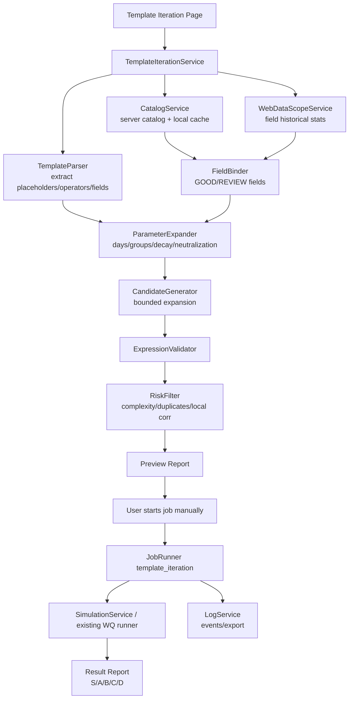

# WQ 模板输入迭代页面可执行文档

更新时间：2026-06-29

状态：本地基础版完成，远程 expression job 待接入。本文是后续实现“模板输入模式”的唯一执行依据；后续代码只按本文的边界、页面结构、服务接口和测试清单推进。

## 1. 目标

新增一个独立 GUI 页面：用户输入一个或多个 Alpha 模板，系统按已勾选地区、字段 catalog、可勾选优化方式和开放参数生成迭代候选，并把候选送入已有回测/优化/日志体系。

本页面不替用户提交 Alpha，不提交 PPA，不处理 SA 主流程。当前候选类型仍然只面向 `Regular Alpha / RA`。

## 2. 依据与冲突处理

已读取并采用的规则：
- `worldquant-brain-cyber-game-king` 为主：稳定性优先、限制过拟合、self-corr 红线、本地安全线、Decay/Neutralization sweep、ATLAS 分层、不要迷信单点高 Sharpe。
- `wq-top-advisors-skill` 为辅：模板化、字段/operator 解析、知识层查询、不同数据集使用不同模板、回测记录复盘、减少重复变体。
- `document-generate` 的方式：先研究当前代码，再按 Diataxis 思路分清 reference/how-to/explanation，并让文档可验证、可追踪。
- gstack main 页面已打开确认最新仓库入口；本机 gstack skills 目录不是 git 仓库，不能直接 `git pull`。因此本次使用的是最新远程页面可见的规则方向，而不是修改用户全局 skill 目录。

冲突处理：
- 如果黄金顾问经验之间冲突，只执行共同部分。
- 如果 `wq-top-advisors-skill` 与 `worldquant-brain-cyber-game-king` 冲突，以 `worldquant-brain-cyber-game-king` 为准。
- 如果论坛经验给出激进阈值，除非 skill 主体或现有代码能确认，否则只作为可配置参数，不写死。

## 3. 当前代码基线

可复用模块：
- `app/main.py`
  - 已有 `/optimization` 页面。
  - 已有 `/api/jobs/optimization` 后台任务入口。
  - 已有 `/api/optimization/variants/{alpha_id}` 和 `/optimization/{alpha_id}/variants`。
- `app/services/alpha_enhancement.py`
  - 已有 `generate_variants_for_plan`。
  - 已有 modes: `stable`, `group`, `trade`, `template`, `power`, `runtime`, `basic`。
  - 当前只支持从已有 Alpha plan 生成变体，不支持从用户模板直接输入。
- `app/services/optimization_planner.py`
  - 已有 failed checks 到 strategy/modes 的映射。
  - 可复用表达式抽取、表达式校验、优化分档思路。
- `app/services/log_service.py`
  - 已有 GUI/job log 读取与导出。
- `app/templates/base.html`
  - 当前左侧导航有 Dashboard、Backtest、Optimization、Alphas、Settings、Logs。

设计结论：
- 新页面不应塞进 `/optimization`。现有页面处理“已有 Alpha 的优化候选”；新页面处理“模板输入生成候选”。
- 新服务不要改写 `alpha_enhancement.py` 的既有行为；新建模板模式服务，再复用其表达式验证和少量 variant 生成思想。

## 4. 页面入口

新页面名称：模板迭代

推荐路由：
- 页面：`GET /template-iteration`
- 预览 API：`POST /api/template-iteration/preview`
- 启动任务：`POST /api/jobs/template_iteration`
- 结果 API：`GET /api/template-iteration/results/{job_id}`

导航位置：
- 左侧菜单放在“优化规划”之后、“Alpha 记录”之前。
- 图标使用 Font Awesome：`fa-layer-group` 或 `fa-diagram-project`。

页面两层深度：
- 第一层：`template_iteration.html` 展示和交互。
- 第二层：`TemplateIterationService` 统一处理模板解析、参数展开、字段绑定、变体生成、预览和任务参数归一化。

## 5. 页面布局

页面不做营销页，只做工作台。

顶部摘要：
- 模板数量。
- 预计候选数量。
- 已选地区。
- 每日预算剩余估算。
- 当前模式：只生成 Regular/RA。

左侧输入区：
- 地区 checkbox：`USA`、`ASI`、`EUR`。
- 固定 delay：`D1`，默认不可改。
- 模板输入 textarea，支持一个或多个模板。
- 模板命名输入，可选。
- 字段来源选择：
  - `GOOD_FIELD_ONLY` 默认。
  - `GOOD_AND_REVIEW` 可选。
  - `MANUAL_FIELDS` 可选。
- 最大候选数。
- 每模板最大字段组合数。

右侧参数区：
- 优化方式 checklist。
- 每个优化方式展开后显示参数。
- 参数有默认值，但用户可改。
- 参数变更后先走 preview，不直接创建回测任务。

下方输出区：
- 模板解析结果。
- 字段绑定结果。
- 生成候选预览。
- 表达式校验状态。
- 重复/高风险候选隐藏原因。
- 最近任务和日志。

## 6. 模板语法

第一版只支持显式占位符，不做自然语言模板解析。

占位符：
- `{field}`：单字段。
- `{field_a}`、`{field_b}`：双字段。
- `{group}`：分组变量。
- `{days}`：时间窗口。
- `{decay}`：Decay 参数。
- `{neutralization}`：settings 参数，不直接写进表达式。
- `{threshold}`：阈值参数。

示例模板：

```text
rank(ts_delta({field}, {days}))
group_rank(ts_mean({field}, {days}), {group})
trade_when(greater(volume, ts_mean(volume, 20)), rank({field}), -1)
rank(divide({field_a}, {field_b}))
```

禁止第一版支持：
- 自动把自然语言改写成表达式。
- 自动提交。
- PPA/SA 模板混跑。
- 无边界全字段笛卡尔积。
- 为降低相关性而盲目堆复杂算子。

## 7. 可勾选优化方式与开放参数

所有方式默认可勾选，不勾选则不参与候选生成。

| 方式 | 默认 | 参数 | 用途 | 风险控制 |
| --- | --- | --- | --- | --- |
| 字段替换 | 开 | `max_fields_per_template=50`、`field_quality=GOOD_FIELD_ONLY` | 用好字段替换 `{field}` | 不用坏字段；无 webdatascope 统计只降置信度 |
| 双字段组合 | 关 | `max_pairs=100`、`pair_mode=same_dataset/cross_dataset` | 替换 `{field_a}`/`{field_b}` | 默认同 dataset，避免无意义组合爆炸 |
| 时间窗口 sweep | 开 | `days=[5,20,60,120,252]` | 替换 `{days}` | 只用常见窗口，避免乱扫 |
| Decay sweep | 开 | `decays=[0,1,3,5,10,20]` | settings 稳健性测试 | 断崖式下跌降档 |
| Neutralization sweep | 开 | `neutralizations=[MARKET,SECTOR,INDUSTRY,SUBINDUSTRY,STATISTICAL]` | 检查行业/风格暴露 | 平台不可用选项自动剔除 |
| Group sweep | 开 | `groups=[sector,industry,subindustry]` | 替换 `{group}` | 不做过多自定义 group |
| 稳定化包装 | 关 | `winsorize_std=[4,6]`、`backfill_days=[20,60]` | 降噪、处理极值或缺失 | 包装后表达式复杂度超限则隐藏 |
| trade_when 触发 | 关 | `volume_gate=[adv20,adv60]`、`exit=-1` | 降 turnover 或过滤无效交易 | 压 turnover 后信号消失则降档 |
| rank/zscore 标准化 | 开 | `standardizers=[rank,zscore,normalize]` | 横截面标准化 | 不重复套娃标准化 |
| 本地相关性剪枝 | 开 | `candidate_corr_max=0.80`、`submit_safe_sc=0.68` | 先剪同质候选 | 超过安全线不进强候选 |
| 表达式复杂度限制 | 开 | `operator_count_max=8`、`field_count_max=3` | 防止过拟合 | 超限隐藏 |

注：`prod_corr`、`self_corr`、平台 check 的硬结果以平台/本地 PnL 数据为准，预览阶段只能做风险标记。

## 8. 数据流



## 9. 候选生成顺序

执行顺序固定，避免随机拼装：

1. 解析模板。
2. 校验占位符。
3. 读取字段 catalog。
4. 用字段质量过滤候选字段。
5. 展开字段组合。
6. 展开 `{days}`、`{group}` 等表达式参数。
7. 展开 settings sweep。
8. 表达式校验。
9. 去重。
10. 复杂度过滤。
11. 本地相关性剪枝。
12. 生成 preview。
13. 用户手动启动任务。

## 10. 评分与隐藏规则

Preview 阶段只做静态评分：
- 模板有效性。
- 字段质量。
- 表达式复杂度。
- 组合数量。
- 是否重复。
- 是否使用坏字段。

回测后再做动态评分：
- Sharpe。
- Fitness。
- Margin。
- Returns。
- Turnover。
- Drawdown。
- yearly stats。
- self-corr。
- prod-corr。
- sub-universe。
- checks。

默认隐藏：
- 表达式语法错误。
- 字段不可用。
- 坏字段。
- operator 无权限。
- operator_count > 8。
- field_count > 3。
- 生成自同模板且静态结构重复。
- self-corr > 0.70。

## 11. 错误处理

| 错误 | 原因 | 处理 |
| --- | --- | --- |
| `TEMPLATE_PARSE_ERROR` | 模板括号、占位符或语法不可解析 | 不创建任务，只展示错误行 |
| `UNKNOWN_PLACEHOLDER` | 使用未支持占位符 | 标红并提示支持列表 |
| `NO_MATCHED_FIELDS` | 当前地区/字段质量条件下无字段 | 降为人工检查，不自动放宽 |
| `CANDIDATE_EXPLOSION` | 候选数量超过上限 | 截断并显示截断原因 |
| `EXPRESSION_INVALID` | 表达式校验失败 | 隐藏该候选 |
| `SETTING_UNAVAILABLE` | 平台不支持某 settings | 自动剔除该 settings，记录日志 |
| `PLATFORM_LIMIT` | 并发/每日上限/网络限制 | 使用现有 JobRunner 等待/暂停逻辑 |

## 12. 日志事件

新增结构化事件：
- `TEMPLATE_PAGE_OPENED`
- `TEMPLATE_PARSED`
- `TEMPLATE_PARSE_FAILED`
- `TEMPLATE_FIELDS_BOUND`
- `TEMPLATE_CANDIDATES_PREVIEWED`
- `TEMPLATE_CANDIDATE_HIDDEN`
- `TEMPLATE_JOB_CREATED`
- `TEMPLATE_JOB_STARTED`
- `TEMPLATE_JOB_RESULT_RECEIVED`
- `TEMPLATE_REPORT_EXPORTED`

日志必须能按 `job_id`、`template_id`、`region`、`reason_code` 过滤。

## 13. 最小实现边界

第一版只交付：
- 独立页面。
- 多模板 textarea。
- 地区 checkbox。
- 可勾选优化方式。
- 参数输入。
- preview。
- 手动启动后台任务。
- 最近任务和日志。
- 单元测试覆盖 parser、expander、risk filter、route。

第一版不做：
- 自动提交。
- PPA。
- SA。
- 自然语言模板生成。
- 复杂 AI agent 自主改写模板。
- 远程修改 alpha 属性。
- 新增原生网络请求重写已有 WQ 客户端。

## 14. 实施任务清单

### Task 1: 模板解析服务

文件：
- Create: `app/services/template_iteration.py`
- Test: `tests/test_template_iteration.py`

步骤：
- [x] 定义 `TemplateSpec`、`TemplateIterationOptions`、`TemplateCandidate` dataclass。
- [x] 实现 `parse_templates(text: str)`，按空行或 `---` 分隔多模板。
- [x] 提取占位符和静态复杂度。
- [x] 校验未知占位符。
- [x] 单测覆盖多模板、未知占位符、无效表达式。

### Task 2: 参数展开与候选生成

文件：
- Modify: `app/services/template_iteration.py`
- Test: `tests/test_template_iteration.py`

步骤：
- [x] 实现 `expand_template_candidates(...)`。
- [x] 支持 `{field}`、`{field_a}`、`{field_b}`、`{group}`、`{days}`。
- [x] 支持候选数量上限。
- [x] 调用现有 `validate_expression`。
- [x] 生成隐藏原因：重复、无效表达式、复杂度超限。

### Task 3: 页面与 API

文件：
- Modify: `app/main.py`
- Modify: `app/templates/base.html`
- Create: `app/templates/template_iteration.html`
- Test: `tests/test_template_iteration_page.py`

步骤：
- [x] 添加 `GET /template-iteration`。
- [x] 添加 `POST /api/template-iteration/preview`。
- [ ] 添加 `POST /api/jobs/template_iteration`。
- [x] 左侧导航新增“模板迭代”。
- [x] 页面包含模板输入、地区勾选、参数区、preview 表格。

### Task 4: JobRunner 接入

文件：
- Modify: `app/job_runner.py`
- Create or modify service adapter as needed.
- Test: `tests/test_template_iteration_job.py`

步骤：
- [ ] 新增 job kind `template_iteration`。
- [x] job 参数构造使用 normalized payload，不从页面散读。
- [ ] 任务执行时逐候选提交到已有 simulation 流程。
- [ ] job log 写入新增事件。
- [ ] 支持暂停/恢复已有机制。

### Task 5: 报表与日志导出

文件：
- Modify: `app/services/log_service.py`
- Modify: `app/templates/template_iteration.html`
- Test: `tests/test_log_service.py`

步骤：
- [x] preview 支持导出 CSV。
- [ ] job 结果支持 JSONL。
- [ ] 日志按 `template_id`、`reason_code` 过滤。
- [x] 页面显示隐藏原因排行。

### Task 6: 文档与验收

文件：
- Modify: `README.md`
- Modify: `doc/wq_candidate_submission_and_data_error_workflow.md`
- Test: targeted pytest commands.

步骤：
- [x] README 增加“模板迭代”入口说明。
- [x] 在候选提交流程文档中链接本文。
- [x] 运行 `python -m pytest tests/test_template_iteration.py tests/test_template_iteration_page.py -q`。
- [x] 运行 `python -m pytest tests/test_alpha_enhancement.py tests/test_optimization_planner.py -q`，确认旧优化流不被破坏。

## 15. 验收标准

功能验收：
- 用户能打开 `/template-iteration`。
- 用户能输入多个模板。
- 用户能勾选 `USA / ASI / EUR`。
- 用户能勾选优化方式并修改参数。
- 点击 preview 后能看到候选、错误、隐藏原因和预计数量。
- 点击启动后创建 `template_iteration` job。
- job 有日志，可导出。

稳定性验收：
- 不自动提交。
- 不提交 PPA。
- 不混入 SA。
- 候选数量受上限控制。
- 坏字段默认隐藏。
- 表达式复杂度超限默认隐藏。
- 不新增绕过现有 WQ client 的原生请求。

测试验收：
- 新增模板解析、展开、页面、job 测试。
- 旧的 alpha enhancement 和 optimization planner 测试仍通过。

## 16. 当前默认决策

默认地区：沿用用户勾选，页面默认 `USA / ASI / EUR` 全选。

默认字段：只用 `GOOD_FIELD_ONLY`。

默认优化方式：
- 开：字段替换、时间窗口 sweep、Decay sweep、Neutralization sweep、Group sweep、rank/zscore 标准化、本地相关性剪枝、复杂度限制。
- 关：双字段组合、稳定化包装、trade_when 触发。

默认运行：先 preview，再由用户手动启动 job。

默认结果：只进入候选报表，不自动提交。

## 17. 函数职责与测试矩阵

本节约束实际编码。若当前实现不满足这里的职责，应替换实现，不为兼容旧代码而保留错误抽象。

### 17.1 模块边界

| 模块 | 文件 | 职责 | 不允许做的事 |
| --- | --- | --- | --- |
| TemplateIterationService | `app/services/template_iteration.py` | 模板解析、参数展开、字段绑定、静态隐藏规则 | 不发远程请求，不创建 job，不写数据库 |
| TemplateIteration Routes | `app/main.py` | 页面展示、preview API、后续 job 创建 API | 不写复杂业务规则，不直接操作 WQ API |
| TemplateIteration Page | `app/templates/template_iteration.html` | 参数输入、候选展示、勾选、复制、导出按钮 | 不计算候选质量，不决定是否可提交 |
| Catalog Adapter | 复用 `app/services/catalog_service.py` | 从本地 catalog 读取 dataset / field | 不在模板模块里重新实现 Excel 读取 |
| Expression Validator | 复用 `app/services/expression_validator.py` | 本地表达式语法和 operator 参数校验 | 不替代平台最终校验 |
| Future Expression Runner | 待新增 | 对 expression 候选做 dry-run / simulation job | 不复用 dataset_id 三阶段 job 的错误输入模型 |

### 17.2 当前函数职责

| 函数 | 当前状态 | 输入 | 输出 | 测试 |
| --- | --- | --- | --- | --- |
| `parse_templates` | 已实现，需补 `---` 分隔支持 | `str | list[str]` | `list[TemplateSpec]` | 多模板、空模板、占位符集合 |
| `expand_template_candidates` | 已实现基础版，REVIEW 策略和复杂度过滤已补 | 模板、字段、options | `TemplateIterationResult` | GOOD 可见、BAD 隐藏、REVIEW 可配置、上限截断、sweep 展开 |
| `_render_template` | 已实现基础版，后续可由更清晰的 binder 替代 | 模板、字段、参数值 | expression | `{field}`、`{days}`、`{decay}`、`{group}` |
| `_region_allowed` | 已实现 | field、regions | bool | region 匹配、不带 region 的字段 |
| `_quality_allowed` | 已实现 | quality、quality set | bool | GOOD/BAD/REVIEW/空质量 |
| `_int_list` | 已下沉到 service | JSON 值 | `list[int]` | list、逗号字符串、坏值 |
| `_str_list` | 已下沉到 service | JSON 值 | `list[str]` | list、逗号字符串、空值 |
| `_load_template_iteration_fields` | 已实现 route helper，后续可拆成 adapter | regions/universe/delay | fields | 无手动字段时读本地 catalog |

### 17.3 必须新增或替换的函数

| 函数 | 所在文件 | 作用 | 验证方式 |
| --- | --- | --- | --- |
| `normalize_template_iteration_options` | `app/services/template_iteration.py` | 把页面/API 参数归一化为 `TemplateIterationOptions` | 逗号字符串、list、空值、非法值测试 |
| `classify_field_quality` | `app/services/template_iteration.py` | 统一 GOOD/REVIEW/BAD 规则 | 已覆盖 GOOD 可见、BAD 隐藏、REVIEW 按配置显示 |
| `dedupe_candidates` | `app/services/template_iteration.py` | 按 expression 去重 | 已覆盖重复模板只保留一次 |
| `count_expression_complexity` | `app/services/template_iteration.py` | 统计 operator 数和 field 数 | 已覆盖超过 operator_count_max 隐藏 |
| `hide_candidate` | `app/services/template_iteration.py` | 生成统一 reason_code | 每个 reason_code 有测试 |
| `build_preview_report` | `app/services/template_iteration.py` | 汇总 visible/hidden/summary/export payload | summary 数量准确 |
| `create_template_iteration_job_params` | `app/services/template_iteration.py` | 从勾选候选生成 job params | 已覆盖不包含 PPA/SA/submit 字段 |
| `run_expression_candidate_job` | 待新增 service | 执行 expression 候选回测 | dry-run / fake WQ client 测试 |

### 17.4 Reason Code 测试矩阵

| reason_code | 触发条件 | 测试文件 |
| --- | --- | --- |
| `BAD_FIELD` | 字段质量为 BAD | `tests/test_template_iteration.py` |
| `REVIEW_FIELD` | 字段质量为 REVIEW 且未开启 REVIEW 模式 | `tests/test_template_iteration.py` |
| `UNKNOWN_PLACEHOLDER` | 模板包含未支持占位符 | `tests/test_template_iteration.py` |
| `EXPRESSION_INVALID` | 渲染后表达式本地校验失败 | `tests/test_template_iteration.py` |
| `CANDIDATE_EXPLOSION` | 生成数量超过上限 | `tests/test_template_iteration.py` |
| `DUPLICATE_EXPRESSION` | expression 重复 | `tests/test_template_iteration.py`、`tests/test_template_iteration_page.py` |
| `COMPLEXITY_LIMIT` | operator 或 field 数超限 | `tests/test_template_iteration.py` |
| `NO_MATCHED_FIELDS` | 当前条件下无字段 | `tests/test_template_iteration.py` |
| `SETTING_UNAVAILABLE` | settings 不在当前 region/universe 可用列表 | 待平台 settings 数据后补 |

### 17.5 下一轮实现顺序

1. 已完成：把 option 解析从 `app/main.py` 下沉到 `template_iteration.py`。
2. 已完成：补 `classify_field_quality`，支持 GOOD / REVIEW / BAD。
3. 已完成：补 `dedupe_candidates`。
4. 已完成：补 `count_expression_complexity`。
5. 已完成：补 `NO_MATCHED_FIELDS` 和 `CANDIDATE_EXPLOSION` 的 reason_code。
6. 已完成：页面显示隐藏原因排行榜。
7. 再设计 expression candidate job，不复用 dataset 三阶段 job。

### 17.6 当前验收命令

```powershell
python -m pytest tests\test_template_iteration.py tests\test_template_iteration_page.py tests\test_optimization_pages.py
python -m pytest tests
```
