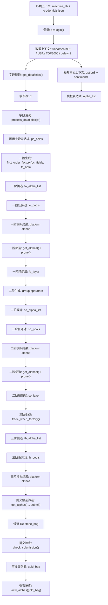

# Notebooks

本目录保存 Jupyter notebook。核心 Python 库仍在 `consultant/` 根目录，因此建议从 `consultant/` 根目录启动 Jupyter，或在 notebook 中保持项目根目录为当前工作目录。

VS Code / Pylance 静态分析不会可靠执行 notebook 前面 cell 里的 `sys.path` 修改，也不适合分析 `from ... import *`。因此 notebook 使用显式导入，并通过 [../pyrightconfig.json](../pyrightconfig.json) 和 [../.vscode/settings.json](../.vscode/settings.json) 把 `src/` 加入分析路径。

## 相关参考代码 (Related Reference Code)

本项目中与 Notebook 进行配合的有用 Python 工具代码已归档至 `reference/code/` 目录：
- **因子剪枝 (`reference/code/pruning/`)**：
  - [expression_pruner.py](../code/pruning/expression_pruner.py) —— 提供表达式语法结构解析去重剪枝。
  - [correlation_pruner.py](../code/pruning/correlation_pruner.py) —— 提供日收益率互相关 Pearson 矩阵贪心剪枝。
- **因子分析 (`reference/code/analysis/`)**：
  - [super_alpha_correlation.py](../code/analysis/super_alpha_correlation.py) —— 批量多线程计算与平台 OS 因子的最大自相关。
  - [fast_pnl_downloader.py](../code/analysis/fast_pnl_downloader.py) —— 绕过标准 PnL API 限额的比赛接口 PnL 下载工具。
- **因子优化 (`reference/code/optimization/`)**：
  - [robust_sharpe_optimizer.py](../code/optimization/robust_sharpe_optimizer.py) —— 自动对中性化、Decay、截断及表达式变体进行网格寻优。

## Files

| Notebook | 中文说明 | English |
|---|---|---|
| [alpha_generation_pipeline.ipynb](alpha_generation_pipeline.ipynb) | 当前主要工作 notebook，用于读取数据字段、构造和运行 Alpha 流程。 | Current main working notebook for data-field reading and alpha workflow. |
| [alpha_returns_analysis.ipynb](alpha_returns_analysis.ipynb) | Alpha 返回字段、前 5 条结果、详情接口和曲线图展示。 | Alpha return fields, first five results, detail API, and chart examples. |
| [archive/Alpha Machine.ipynb](archive/Alpha%20Machine.ipynb) | 原始/备用 notebook。 | Original or secondary notebook. |
| [archive/Alpha Machine WebDataScope Neutralization.ipynb](archive/Alpha%20Machine%20WebDataScope%20Neutralization.ipynb) | 包含 WebDataScope 与中性化回测的特异测试版本。 | Volatility/neutralization analysis on WebDataScope. |

## Run With Recorder

从 `consultant/` 根目录运行：

```powershell
py -3 scripts/run_alpha_machine_copy.py
```

运行记录会写入 `runs/alpha_machine/`，该目录是本地运行产物，不提交到 git。

## Alpha 因子生成运行流程

[alpha_generation_pipeline.ipynb](alpha_generation_pipeline.ipynb) 的核心目标是：从一个数据集读取字段，批量生成 Alpha 表达式，提交模拟任务，再从历史模拟结果中筛选更强的表达式继续升级，最后检查哪些 Alpha 可以提交。



## Cell-Level Map

| Cell | Step | What It Does | Output |
|---:|---|---|---|
| 1-2 | 环境准备 | `import os`，导入 `machine_lib` 的所有辅助函数。 | 可直接调用 `login()`、`get_datafields()`、`multi_simulate()` 等。 |
| 4 | 登录 | `s = login()` 读取 `../credentials.json` 并建立 WorldQuant session。 | 已登录 session。 |
| 6 | 读取字段 | 读取 `fundamental91` 在 `USA / TOP3000 / delay=1` 下的数据字段。 | 原始字段表 `df`。 |
| 8 | 字段预处理 | `process_datafields(df)` 将 Matrix/Vector 字段转成可进入 Alpha 表达式的字段表达式。 | `pc_fields`。 |
| 10 | 一阶表达式 | `first_order_factory(pc_fields, ts_ops)` 用时间序列算子生成一阶 Alpha。 | `first_order`。 |
| 12-13 | 一阶任务池 | 给表达式配置初始 `decay=6`，随机打乱，切成模拟任务池。 | `fo_pools`。 |
| 17-19 | 一阶结果筛选 | `get_alphas()` 拉取历史结果，按 Sharpe/Fitness 等过滤，再 `prune()` 剪枝。 | `fo_layer`。 |
| 21-23 | 二阶表达式 | 对一阶结果套 `group_neutralize/group_rank/group_zscore`，生成二阶任务池。 | `so_pools`。 |
| 25-27 | 三阶表达式与模拟 | 拉取二阶结果，剪枝后套 `trade_when_factory()`，再提交三阶模拟。 | `th_pools` 和平台模拟任务。 |
| 29-31 | 提交前检查 | 以更高阈值拉取候选 Alpha，调用 `check_submission()`，最后 `view_alphas()` 排序展示。 | `gold_bag` 可提交候选。 |
| 34 | 额外模板分支 | 读取 `option8` 与 `sentiment1` 字段，构造情绪 x 期权模板表达式。 | `alpha_list`。 |

## 获取因子信息

旧流程里的 `get_alphas()` 仍可使用，它返回给 `prune()` 用的 list。需要完整字段时，用 `get_alphas_full()`，返回 DataFrame：

```python
alphas = get_alphas_full(
    start_date="2025-11-04",
    end_date="2026-06-06",
    sharpe_th=1.0,
    fitness_th=0.7,
    region="USA",
)

alphas[["alpha_id", "sharpe", "fitness", "turnover", "decay", "next_decay", "expression"]]
```

如果不传 `start_date/end_date`，会按其它条件分页获取全部匹配因子。

## Key Parameters

| Parameter | Current Value | Meaning |
|---|---|---|
| `dataset_id` | `fundamental91` | 主流程使用的数据集。 |
| `region` | `USA` | 运行地区。 |
| `universe` | `TOP3000` | 股票池范围。 |
| `delay` | `1` | day1 数据。 |
| `init_decay` | `6` | 一阶表达式初始 decay。 |
| first-order query | Sharpe `> 1`, Fitness `> 0.7` | 一阶结果进入二阶前的粗筛阈值。 |
| second-order query | Sharpe `> 1.3`, Fitness `> 0.8` | 二阶结果进入三阶前的筛选阈值。 |
| submit query | Sharpe `> 1.58`, Fitness `> 1` | 提交前候选 Alpha 的筛选阈值。 |
| `prune(..., keep_num=5)` | `5` | 每类字段最多保留 5 个候选，避免同质化过多。 |

## Optimization Notes

- 主流程目前把参数写死在 notebook 单元里，后续可以抽成配置：`dataset_id`、`region`、`universe`、`delay`、Sharpe/Fitness 阈值、`init_decay`。
- `multi_simulate()` 会真实提交模拟任务；调试流程时应先只生成 `*_pools`，确认表达式数量和样例后再提交。
- `get_alphas()` 查询的是历史 Alpha 结果，日期窗口和阈值会直接影响后续二阶、三阶表达式质量。
- `check_submission()` 会逐个调用平台检查接口，数量大时较慢。遇到 `RemoteDisconnected` / `ConnectionError` 这类远端断连时，底层 `get_check_submission()` 会先重试；连续失败后返回 `sleep`，上层会等待 5 分钟后重登并把该 Alpha id 放回队列。连续触发 2 次后，后续改为每 1 小时重登一次，避免程序直接死掉。
- 后续可以加本地检查缓存，避免重复查同一个 Alpha id。
